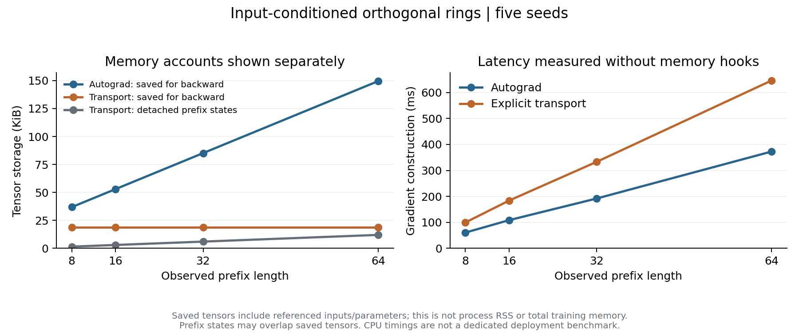

# 正交环中的实时行为约束传播：实现、验证与实验分析

2026-09-11。实验实现固定于提交 **ef9b3f2**。本轮完成了真实行为约束从读出、跨时间环传播到共享参数更新的连接，保留正交、环形结构和在线更新。完整自动微分与显式传播在相同参数处的梯度一致；显式传播降低了计算图存储，但当前实现更慢，没有产生独立的棋力优势。

[修改方案](constraint_transport_plan.md)；[逐种子汇总与配对区间](results/go_constraint_summary.json)；[传播实现](../mqr/constraint_transport.py)；[在线约束与恢复](../mqr/go_constraints.py)。

## 1. 本轮实现了什么

原有 OGD 已经联合约束所有任务参数，但行为敏感度藏在整段自动微分图中。本轮新增可单独检验的显式伴随：

1. 从实际终端策略输出或损失取得状态法向量与直接参数梯度。
2. 使用每个时间步、每个环的实际输入条件化旋转传递法向量。
3. 重建一个局部计算图，计算注入、旋转角和角度控制器的参数贡献。
4. 累加共享参数在所有相关时间步的贡献，再执行现有联合 OGD。
5. 在当前参数版本刷新行为基底，按需检查相对固定参考策略的 KL。

传播对象是行为的导数，不是权重值，也不是任意选取的隐空间正交基。各时间步不随意归一化法向量，否则会改变共享参数梯度的相对贡献；正交基底选择在全局参数梯度形成后进行。

新增接口：

- **terminal_gradients**：输入 [T,D] 或 [T,B,D]，返回终端目标值、参数 Jacobian、布局和传播诊断；支持 autograd 与 transport。
- **pullback_ring_covectors**：对每环 [目标数,B,N] 的法向量使用逆序 Givens 传递。
- **ConstraintGoBehaviorMemory**：相同原始锚点、相同候选目标和确定性近似并列选择规则，可切换梯度后端。
- **ConstraintGoSession**：继承原有预测、反馈、OGD、KL 和检查点协议，并恢复新后端与刷新状态。

旧接口的默认行为没有改变。新接口要求 GoResearchCore 的状态激活为恒等、转移为有符号正交或恒等、条件控制器只依赖外生输入。锚点重放与本轮对局均启用全部写门。隐状态控制器、非线性状态激活或其他写门协议需要另行推导。

本轮没有将受保护子空间残差结构设为默认网络。该结构首先需要明确隐坐标与受保护行为的对应关系；本轮先完成真实行为约束的精确传播和对照。

## 2. 数学合同

采用列向量，在固定输入、写门和参数版本下：

\[
h_{t+1}^{(r)}
=\rho_r R_r(x_t;\theta)h_t^{(r)}+b_r(x_t;\theta),
\qquad R_r^\top R_r=I.
\]

对终端分数 \(s\)，令 \(q_t^{(r)}=\partial s/\partial h_t^{(r)}\)，有

\[
q_t^{(r)}=\rho_r R_r^\top q_{t+1}^{(r)},\qquad
\|q_t^{(r)}\|_2=\rho_r\|q_{t+1}^{(r)}\|_2.
\]

代码按行存储，因此执行 rho * q @ R，使用 transpose=True 的逆序 Givens。携带率为零的环向过去传递零法向量，不能被解释为可逆历史通道。

令 \(B_t=\partial h_{t+1}/\partial\theta\)，则

\[
\boxed{\nabla_\theta s
=g_{\mathrm{direct}}+\sum_t B_t^\top q_{t+1}.}
\]

直接项包含实际空间读出、位置查询、核心读出矩阵以及外部记忆查询的参数贡献。局部 VJP 包含 \((\partial R/\partial\theta)h_t\) 和注入导数。参数在时间上共享，必须累加其所有贡献，不能把各时间步当成独立参数块。

完整自动微分后端保存同一有限序列的计算图。显式后端先无图重放、保存状态，再逆序构建局部图，因此在适用条件下给出相同导数。它仍有 \(O(TBN)\) 的额外状态存储，不是无限历史或常数总内存算法。

对保留的参数约束行矩阵 \(A\)，联合更新满足

\[
\delta=-\eta P_\theta g,\quad
P_\theta=I-A^\top(AA^\top)^\dagger A,\quad
A\delta=0,\quad g^\top\delta=-\eta\|P_\theta g\|^2.
\]

现有 OGD 支持学习率白化；本轮使用共同学习率。低秩基底只保护保留方向。对光滑保护分数 \(f\)，局部 Hessian 范数有界时：

\[
|\Delta f|
\leq\|P_\theta\nabla f\|\,\|\delta\|
+\tfrac12L_f\|\delta\|^2.
\]

当前梯度刷新降低陈旧方向误差，不能消除有限步非线性项。KL 检查覆盖保存锚点的完整策略，并相对不变的 A 阶段参考策略计量累计漂移。

## 3. 精确性与资源核查

三个配置为普通正交环、输入条件化正交环、条件正交环加 16 槽原始记忆。五种子分别运行 8/16/32/64 步合法围棋前缀，共 **60 个前缀配置**。比较时使用相同参数、观察和两个终端策略分数。

- 全参数梯度最大绝对差：**1.40×10⁻⁹**。
- 最大整体相对差：**4.10×10⁻⁹**；另外核查各参数块，避免大读出梯度掩盖小旋转梯度。
- 逐环伴随范数关系最大误差：**1.16×10⁻¹⁰**。
- float64 投影交换、受保护坐标与分块投影等价式最大误差：**2.66×10⁻¹⁵**。
- 单元测试另用有限差分核对早期注入和输入条件化角度梯度，覆盖冻结参数、独立批量流、截断边界和不支持的 Jacobian。

以下为 64 步、单流、两个约束分数的五种子均值；各配置内的两个后端完全同模型。

| 配置 | 自动微分保存张量 B | 显式传播保存张量 B | 额外无图状态 B | 自动微分耗时 s | 显式传播耗时 s |
|---|---:|---:|---:|---:|---:|
| 普通正交 | 103436 | 19148 | 12288 | 0.323 | 0.550 |
| 输入条件化正交 | 153100 | 19148 | 12288 | 0.373 | 0.646 |
| 条件正交＋外部记忆 | 267500 | 133548 | 12288 | 0.374 | 0.653 |

保存张量通过 autograd hooks 按底层存储去重计量，包含其引用的输入和参数；无图状态另行统计，两项可能重叠。它们不是进程 RSS，也没有覆盖全部优化器、梯度矩阵和 Python 对象。计时独立于 hooks，取每种子三次的中位数后求均值。环境为 Python 3.11.11、PyTorch 2.8.0+cu128、NumPy 2.0.1；实际使用 CPU、每进程一个 PyTorch 线程，CPU 未独占。

显式后端减少了长前缀的反传图保留，但局部重算与逐步 VJP 使其更慢。外部查询本身的存储仍然存在，因此其读出较大时收益受限。现有 OGD 基底的持久存储没有减少。

## 4. 历史任务与信用长度

任务为合法围棋轨迹中的“黑棋第一着的中心对称点”，相同最终观测对应两个不同合法目标。每种子 96 个训练对、64 个测试对，5×5 棋盘，12 着加初始观测；批大小 16，Adam 学习率 0.006，明确重放 **64 轮**，每方法每种子 768 次更新。它是历史读出诊断，不是一次流式扫描的围棋棋力评估。

| 方法 | 实际末端信用 | 准确率均值 | 逐种子准确率（401/409/419/431/443） |
|---|---:|---:|---|
| 完整自动微分 | 13 | 90.00% | 100 / 100 / 100 / 100 / 50 |
| 完整显式传播 | 13 | 90.00% | 100 / 100 / 100 / 100 / 50 |
| 每 8 步截断的自动微分 | 5 | 50.31% | 50 / 52.34 / 49.22 / 50 / 50 |

所有方法清空历史均为 50%；交换历史后的准确率与原准确率相加为 100%。完整信用相对截断提高 **39.69 个百分点**，五种子配对描述性 bootstrap 区间约 **19.69–50.31 个百分点**。

必须区分配置与实际信用：13 个观测在第 8 步边界 detach 后，末次监督只覆盖最后 5 步。本轮不把这个对照写成“精确最后 8 步对最后 13 步”；边界语义与现有在线 agent 一致。

两个完整后端逐种子准确率一致，但 Adam 长期迭代后的参数和极小 NLL 不必逐位相同。平均运行时间分别约 63.2 秒与 112.3 秒；传播后端本身没有增加准确率。

## 5. 失败种子的根源：状态差异没有成为任务差异

种子 443 在两个完整后端中均停在 50%，保留在正式结果中，没有更换种子。对五个冻结检查点进行了另列的事后诊断：

| 种子 | 原模型准确率 | 配对环状态距离 | 候选动作 margin 的配对差 | 环状态＋当前棋盘线性探针 |
|---|---:|---:|---:|---:|
| 401 | 100% | 5.441 | 21.370 | 91.41% |
| 409 | 100% | 6.204 | 21.601 | 92.97% |
| 419 | 100% | 6.114 | 22.559 | 100% |
| 431 | 100% | 7.240 | 23.264 | 100% |
| 443 | 50% | 0.08292 | 0.00000280 | 69.53% |

线性探针固定 ridge=1，只用原训练集拟合，标准化参数也只由训练集计算；没有更新原模型。仅使用当前棋盘的探针全部为 50%。该探针是事后信息诊断，不计作在线模型性能提升。

失败模型仍有状态差异，全部落点 logits 的配对距离约 0.04545，但两个任务候选之间的相对分数几乎没有变化。softmax 对共同分数平移不敏感，任务无关位置的变化也不能代替候选间的区分。后续应以候选 margin、实际分布差异和历史干预衡量可读性，不能只看状态或全部 logits 的范数。

69.53% 的独立探针说明至少一部分历史信息仍可读出；它不证明完整历史都被保存。成功模型的状态差异也大得多，说明编码与读出的优化共同重要。本轮结果支持“任务可读性与优化停滞仍是问题”，没有证据把失败归因于显式伴随算错梯度。

[冻结检查点哈希与完整事后诊断](results/go_constraint_readout_diagnosis.json)。

## 6. 学生在线对局与行为保护

每种子以同一几何骨干预训练 24 局/24 轮；A、B 各训练 8 局，B 前 6 手随机合法开局。学生实际执行动作，教师在提交预测后提供反馈，双方轮次均提供监督。窗口与任务信用上限均为 8；本轮没有使用终局奖励强化学习。

五种子固定为 401、409、419、431、443。各方法均为同一输入条件化正交环模型：**5218 个可训练参数、8337 个总参数**，秩 8、锚点 8、学习率 0.08。A 阶段使用完全相同的数值更新路径；初始留出指标、A 阶段棋谱和 A 结束指标已逐种子核对一致。

“刷新 1”指每次参数更新后，在下一窗口开始前重建约束；窗口内参数不变。它不是每个观测都更新参数。norm1 使用普通梯度方向，将候选更新缩放到该模型自身当前 OGD 候选的范数；两个分化训练轨迹的整体平均步长不保证完全相同。

B 收益 = B 阶段前 NLL − B 阶段后 NLL，越大越好；A 变化 = B 后 A NLL − B 前 A NLL，负数表示改善。棋力评估冻结参数，每种子 4 个随机合法开局换色，共 8 局。

| 方法 | B 收益 | B 阶段 A 变化 | A 相对初始收益 | 最大锚点 KL | 终局胜场 / 40 |
|---|---:|---:|---:|---:|---:|
| 自动微分，每 8 次更新刷新 | +0.12446 | -0.02869 | +0.13455 | 0.125575 | 9 |
| 自动微分，每次更新刷新 | +0.10833 | -0.03461 | +0.14047 | 0.125822 | 8 |
| 显式传播，每次更新刷新 | +0.10833 | -0.03461 | +0.14047 | 0.125822 | 8 |
| 显式传播＋固定参考 KL 检查 | +0.13935 | -0.06457 | +0.17043 | 0.01000008 | 5 |
| 同范数 SGD，每次刷新参照 | +0.16529 | -0.03941 | +0.14527 | 0.979075 | 10 |

40 局/方法全部正常终局。完整自动微分与显式传播的 A、B、评估三阶段，五种子全部 **120 局棋谱逐局一致**；两者 B 收益均值之差约 \(4.48\times10^{-9}\)。主实验共 600 份棋谱已按规则重放；这是记录核查数，不是 600 个独立统计样本。

刷新 8→1 的 B 收益差为 -0.01613，配对描述性区间约 [-0.03209, +0.00220]，没有建立更频繁刷新提升任务收益的证据。加入 KL 检查的 B 收益差为 +0.03102，区间约 [-0.02198, +0.09581]；均值改善也不能当作稳定优势。

KL 上限配置为 0.01，浮点容差为 \(10^{-7}\)，最大实测 0.0100000789 在容差内。五种子共 71 次更新触发缩步，平均更新范数从约 0.0670 降至 0.0426。保存行为的漂移被约束，胜场没有增加，因此保护质量仍须连接到正确行为、价值或明确旧任务收益。

| 方法 | 平均刷新次数 | 平均刷新时间 s | 平均完整流程时间 s |
|---|---:|---:|---:|
| 自动微分，刷新 8 | 5.4 | 5.23 | 64.26 |
| 自动微分，刷新 1 | 42.2 | 41.23 | 100.11 |
| 显式传播，刷新 1 | 42.2 | 66.50 | 123.34 |
| 显式传播＋KL 检查 | 43.4 | 69.39 | 156.20 |
| 同范数 SGD | 40.8 | 38.81 | 95.26 |

流程计时包含在线训练与评估，不含共享骨干预训练；种子任务并行运行，受共享 CPU 影响。各方法最大持久在线张量量均为 228212 B，显式刷新另外最多暂存 6144 B 前缀状态。OGD 基底仍占 166976 B。本轮没有以同一种子重跑空间骨干棋力基线，不能拿上一轮胜场直接比较。

## 7. 测试、恢复与证据完整性

- **147 项测试通过**：原 139 项，加 8 项新约束传播测试。
- 数学证明、有符号环检查、旧实验 1080 份棋谱验证、离线 Digits 和 quick_start 均通过。
- 新汇总验证逐个核对当前源文件及实验提交中的 Git blob SHA-256、完整五种子矩阵、历史划分、历史干预、初始/A 阶段对齐、配对开局及全部 600 份主实验棋谱。
- 使用 transport1_guard-401 继续真实在线运行 4 局：164 次反馈、22 次参数更新、6 次缩步，最大锚点 KL 为 0.00999523。
- 连续 4 局与分成两次各 2 局执行，棋谱及全部 71 个 Session 张量字段严格相同，仅排除墙钟耗时字段。

[检查命令与日志摘要](results/go_constraint_checks.json)；[恢复核查](results/go_constraint_resume_verify.json)。开发运行使用种子 1703，未混入正式表格。在线实验按完整种子边界分片，没有截断任何纳入统计的方法运行。

学生任务更新仍使用现有有限窗口训练；显式后端用于行为约束，以及独立历史任务的终端训练目标。没有实现无限历史敏感度，也没有完全解决活跃隐状态跨参数更新与当前参数重放状态之间的差异。KL 保证只针对定义好的原始锚点重放。

## 8. 复现与继续在线学习

~~~bash
python3 test_constraint_transport.py
python3 experiments/go_constraint_research.py --study mechanisms \
  --output analysis/results/go_constraint_mechanisms_5seed.json

python3 experiments/go_constraint_research.py --study history \
  --checkpoint-dir checkpoints/go_constraint_v1 \
  --output analysis/results/go_constraint_history_seeds401-443.json

# 对 401、409、419、431、443 分别执行，或作为独立进程运行：
python3 experiments/go_constraint_research.py --study online --seeds 401 \
  --checkpoint-dir checkpoints/go_constraint_v1 \
  --output analysis/results/go_constraint_online_seed401.json

python3 analysis/go_constraint_verify.py
python3 analysis/go_constraint_failure.py
python3 analysis/plot_constraint_transport.py

python3 experiments/play_constraint_go.py \
  checkpoints/go_constraint_v1/transport1_guard-401.pt --games 4 \
  --save checkpoints/go_constraint_v1/continued.pt \
  --output analysis/results/go_constraint_continuation.json
~~~

CLI 默认值就是上述完整协议。检查点存于 Git 忽略目录，不提交模型文件。CodeRecoder 已保护修改前内容；原目录锁由活动桌面进程持有，因此使用逐文件哈希一致的副本，由真实备份引擎创建并独立核验。修改后保护回执见 [保护记录](results/go_constraint_protection.json)。

## 9. 下一步应解决的具体问题

1. **任务相关的读出区分**：使用候选 margin、概率分布变化与训练集探针寻找不可读方向；针对编码/读出停滞建立训练侧目标，再用新的确认种子验证，不能回填本轮分数。
2. **传播重算开销**：探索短块批量局部 VJP，继续与精确后端核对梯度，同时计费额外状态和法向量存储。
3. **有价值的保护对象**：衡量哪些锚点行为值得保持、哪些应被新反馈纠正。“更少漂移”不足以证明更强棋力。
4. **跨参数版本的状态一致性**：明确当前参数重放、活跃混合版本状态与受保护读出的关系，再考虑把受保护子空间残差结构加入默认网络。

当前证据支持显式、精确且可审计的有限历史行为约束传播，支持在本配置中降低反传图存储。它没有证明正交环获得了新的独立性能优势。
