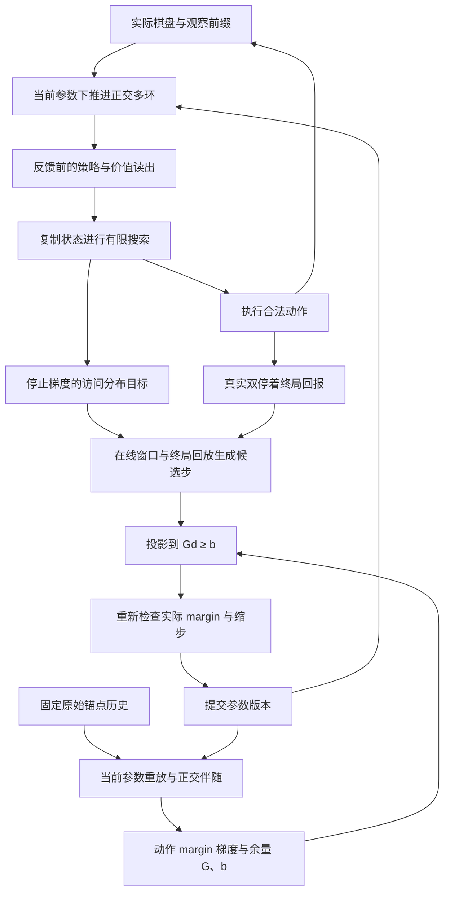

# 共享策略价值、单侧保护与正交传播的数学合同

图中传播的约束来自行为函数的当前梯度，不是把相邻环的权重复制过去。在线状态不会因参数提交而自动全部重放；图中的锚点重放和终局回放是显式独立步骤。前者定义保护坐标，后者提供已经发生的结果监督。

## 1. 价值目标的可识别性

上一轮令同一输入 `(棋盘, 历史, 执棋方)` 拟合学生与外部对手混合对局的回报，但未给出学生执色。两种未编码的控制角色会改变未来转移策略，形成不同条件回报的混合。

本轮主方法改为双方共享同一学生控制规则。固定参数、固定搜索/探索规则的理想化情形中，令 `K_θ(a|s,h)` 为该规则诱导的合法动作分布，定义当前执棋方价值

\[
V^{K_\theta}(s,h)=\mathbb E_{K_\theta,K_\theta}[z\mid s,h].
\]

在非终局和固定参数下，它满足执棋方翻转的递推

\[
V^{K_\theta}(s,h)=\sum_a K_\theta(a|s,h)
\begin{cases}
z(s,a),&s'\text{ 是终局},\\
-V^{K_\theta}(s',h'),&\text{否则}.
\end{cases}
\]

没有额外的“学生控制黑棋还是白棋”条件。外部启发式比赛只评估，不向此值头写入混合角色回报。预训练教师动作可作为策略先验，但教师对教师的回报不被冒充为学生共享策略价值；本轮所有组的初始值头为零。

实际实现每 16 次观察在线更新参数，未来策略会变化。因此终局标签是共享在线控制器的实际 Monte Carlo 回报，不能直接宣称是固定 `θ` 的无偏价值标签。搜索预算、训练根噪声、评估确定性策略也不同。修复消除了外部执色变量造成的目标混合，没有证明平稳性、价值校准、搜索一致收敛或最优棋力。

终局监督只用于学生共享控制开始后的真实观察。随机开局前缀在在线状态和终局回放中都推进一遍，但没有值标签；否则前缀中尚未执行的强制动作也会污染上面的控制语义。

## 2. 从保护概率值改为保护动作关系

锚点 `i` 保存不可变的正确参考动作 `a_i` 和正 margin 的一半 `m_i^min`。这里“正确”只表示训练时教师与模型一致，没有最优着法的保证。实际保护条件为

\[
m_{ib}(\theta)=\log\pi_\theta(a_i|x_i,h_i)
-\log\pi_\theta(b|x_i,h_i)\ge m_i^{\min},\quad b\ne a_i.
\]

这允许目标动作概率提高，也允许其他概率在不改变受保护排序的情况下变化。旧等式 OGD 保护若干单独概率方向，可能同时排除有益变化。本轮仍保留旧方法作为控制。

在当前参数处，对每锚点当前最强两个竞争动作构造

\[
G_j=\nabla_\theta m_j(\theta)^\top,\qquad
b_j=m_j^{\min}-m_j(\theta)\le0.
\]

本轮参数步是凸投影问题

\[
d^*=\underset{d}{\arg\min}\;\tfrac12\|d-d_0\|^2
\quad\text{s.t.}\quad Gd\ge b,
\]

其中 `d_0` 为普通梯度候选经过统一范数裁剪后的参数步。`b<=0` 保证零步可行。因为约束有余量，该集合一般是半空间交集，**不是齐次锥**；实验名中的 `cone` 只是代码标识。约束活跃时，修正量位于当前行为梯度张成的法向空间中；这是正交投影思想的单侧扩展，没有把权重值沿环复制。

## 3. 投影的性质与实现证书

KKT 条件为

\[
d^*=d_0+G^\top\lambda,\quad
\lambda\ge0,\quad Gd^*\ge b,\quad
\lambda_j(G_jd^*-b_j)=0.
\]

行归一化不改变可行域。实现使用 float64 对偶坐标上升，检查原始可行性与 KKT 残差，返回原参数 dtype；未达到容差时退回零步并记录失败，不宣称已经求得投影。

若 `d_0` 已可行，则最小目标为零，所以 `d*=d_0`。这保证有益且未伤害受保护 margin 的候选不会被无条件删除法向分量。

令 `C={d:Gd>=b}`。由于 `0∈C`，凸投影的变分不等式给出

\[
(d_0-d^*)^\top(0-d^*)\le0
\quad\Rightarrow\quad
d_0^\top d^*\ge\|d^*\|^2
\quad\Rightarrow\quad
\|d^*\|\le\|d_0\|.
\]

因此精确投影不会扩大统一范数上限。如果 `d_0=-η_eff g`，还有

\[
g^\top d^*\le-\|d^*\|^2/η_{eff}.
\]

即非零精确投影仍是当前训练损失的一阶下降方向。这不是胜率定理：训练损失可以与真实棋力不一致，有限步也可以偏离线性近似。

当法向与余量固定、活跃集 `A` 在邻域内不变时，还可写成

\[
d^*=P_A d_0+G_A^\top(G_AG_A^\top)^+b_A,\qquad
P_A=I-G_A^\top(G_AG_A^\top)^+G_A.
\]

这里 `+` 为 Moore–Penrose 逆，活跃等式需一致；`P_A^T=P_A` 且 `P_A^2=P_A`，所以局部允许的候选变化仍经过正交投影。新方法保留这一正交几何，同时通过余量和活跃集决定哪些方向此刻需要保护。法向随在线参数刷新、活跃集可以切换，因此它不是一个固定投影矩阵。

提交前重新计算所有竞争动作的非线性 margin。失败时统一缩步 `βd*`，直至可行或零步；因为 `b<=0`，`G(βd*)>=βb>=b`，统一缩步保持线性可行。接受的实际检查在 1e-7 数值容差内保护有限锚点的参考排序。没有声称保护所有局面、所有历史或未见任务。

## 4. 约束如何跨环和时间传播

每环状态更新保留

\[
h_{t+1}^{(r)}=\rho_r R_r(x_t;\theta)h_t^{(r)}+u_r(x_t;\theta),
\qquad R_r^\top R_r=I.
\]

对行为 margin 的终端协向量，列向量记法下

\[
q_t^{(r)}=\rho_r R_r(x_t;\theta)^\top q_{t+1}^{(r)},\qquad
\|q_t^{(r)}\|=\rho_r\|q_{t+1}^{(r)}\|.
\]

共享参数的贡献在原参数坐标中跨时间累加；输入条件化旋转的参数导数包含在局部 VJP 中。最终得到的 `G` 是当前参数、有限原始锚点历史下的行为梯度，而不是存储的旧权重。本轮锚点最多 8 步并从零状态重放，故该保护合同针对这些有限上下文，不覆盖同一棋盘在任意完整历史中的行为。每次已接受更新之后，在下一个预测窗口前刷新，避免使用过期坐标的约束。

并行多环之间的更新耦合来自联合约束。将参数按各环及读出头分块，写成 `G=[G_1 ... G_R G_head]`，KKT 给出

\[
d_r^*=d_{0,r}+G_r^\top\lambda^*,\qquad
GG^\top=\sum_rG_rG_r^\top+G_{head}G_{head}^\top.
\]

所有块使用同一组由当前行为约束求出的乘子 `lambda*`。某一块影响了受保护 margin，会通过联合求解改变其他块的修正量；相互补偿是否允许由全局行为 margin 决定。因此本轮具体实现的是跨时间的协向量传播和跨多环／读出头的联合更新约束。这给出了用户所要求的“传播约束、实时重算”的可计算含义，保护对象仍是任务行为，而非每一层的权重值或每个环的单独贡献。

新增第 4–6 个时间尺度不改变这个等式，但增加参数和计算。`ρ^k` 衰减、输入写入干扰和读出可识别性仍存在；六环比三环强与否只能由同预算对局和干预检验。本轮证明说明约束传播和有限保护的含义，不预先承诺实验收益。

## 5. 在线参数变化与历史状态的一致性

正交性也没有消除“历史由旧参数写入，读出使用新参数”的差异。令同一实际输入序列的在线状态使用 `θ_k`，而对照状态始终用当前参数 `θ_T` 重放。取 `e_k=h_k^live-h_k^replay`，单环满足

\[
e_{k+1}=\rho R_{\theta_T}(x_k)e_k
+\rho\big(R_{\theta_k}(x_k)-R_{\theta_T}(x_k)\big)h_k^{live}
+u_{\theta_k}(x_k)-u_{\theta_T}(x_k).
\]

同一起点为零时，由三角不等式与正交性得到

\[
\|e_T\|\le\sum_{k=0}^{T-1}\rho^{T-1-k}
\left[\rho\|R_{\theta_k}-R_{\theta_T}\|\,\|h_k^{live}\|
+\|u_{\theta_k}-u_{\theta_T}\|\right].
\]

更大的 carry 同时保留更久的信号和参数变化引入的误差。因此只在当前参数重放历史上保持 margin，不自动保证所有混合参数历史中的在线行为。若读出的某个 margin 对状态是 `L`-Lipschitz，则二者 margin 差还可由 `L||e_T||` 控制；仅有正交性不足以给出很小的 `L`。

本轮追加的只读状态审计，在每个六环种子首次被采样到的 B 阶段检查点比较上述两种状态，并报告真实策略/价值差异。该采样是事后诊断，不能替代整个在线流的漂移上界，也不意味着已实施状态重同步。

## 6. 价值改变搜索不等于价值区分了着法

若非终局价值只是 `v(s)=c(s)μ`，其中 `c(s)` 是当前执棋方的 ±1 编码，则符号回传后，所有非终局叶给根的值都相同。它仍可能改变 PUCT 对已访问与未访问分支的探索，因为未访问边的初始 Q 为零。

因此除价值置零外，固定探针还比较

\[
v_{const}(s')=c(s')c(s_{root})v(s_{root}),
\]

保留根处的执色偏好，移除非终局局面之间的价值差异；所有干预都保留真实终局返回。这能区分棋盘相关价值与共同偏置对搜索的影响。最终仍需同一检查点的完整价值置零对局，判断改变的动作是否带来更多胜局。

## 7. 固定历史的约束梯度不等于闭环棋力梯度

伴随后端把实际观察序列固定，计算该有限序列上读出或 margin 的参数导数。对固定历史的行为保护，这正是所需坐标；它不对已经执行的离散着法、搜索访问次数或环境转移反向求导。

作为对照，若假设控制规则 `K_θ` 光滑且在相关动作上为正，有限终局轨迹分布为 `P_θ(τ)`，则期望任务损失满足

\[
\nabla_\theta \mathbb E_{P_\theta}[L_\theta(\tau)]
=\mathbb E_{P_\theta}\left[\nabla_\theta L_\theta(\tau)
+L_\theta(\tau)\sum_t\nabla_\theta\log K_\theta(a_t\mid s_t,h_t)\right].
\]

推导只用乘积法则及 `∇P=P∇log P`。第二项来自参数改变之后对局分布也改变。当前代码不实现该项，也不假设实际离散搜索满足上述光滑条件：搜索分布与真实终局标签均停止梯度，在线任务更新采用 16 步信用窗口。完整锚点历史的约束伴随与任务训练的截断梯度是两种不同计算范围。

因此，更准确的研究判断是：正交传播可以提供可核验的约束梯度与有限行为保护，但“搜索目标比当前策略更好”“值头能够区分好坏续着”“学习后的闭环分布仍可泛化”需要分别检验。即使伴随完全正确、每次更新都被接受，也不能由此推出期望胜率上升。

## 8. 扩大环数仍需读出与信用证据

正交旋转不改变旧状态的范数，但叠加新写入后有

\[
\|h_{t+1}\|^2=\rho^2\|h_t\|^2+\|u_t\|^2
+2\rho\langle R_t h_t,u_t\rangle.
\]

最后一项可以为正或负，正交性没有消除新旧内容干扰。写入尺度 `sqrt(1-rho²)` 只有在适当的不相关、定方差输入假设下才能解释为平衡平均能量，不能当作任意围棋历史的无损存储定理。若写入范数统一不超过 `B`，则 `rho<1` 时有通常的上界 `||h_t|| <= rho^t ||h_0|| + B(1-rho^t)/(1-rho)`；这一稳定性界也不证明历史可被任务区分。

以最慢的 `rho=0.99` 环为例，64 步后的单个旧信号系数约为 0.526，16 步后约为 0.851。本轮任务信用仍为 16：更早的边界状态可以参与当前读出，但其先前写入在该窗口训练中被视为已给定状态。增加环数或延长状态保持，均没有自动延长任务反向信用。需要分别测量“信息保留多久”“标签可区分哪段历史”“梯度实际覆盖哪段历史”，才可把更多环的资源成本连接到可验证收益。

这还需要任务本身提供可用的历史信号。对固定分布、平方损失、当前输入 `X`、额外历史 `H` 与目标 `Y`，最优预测风险之差由条件方差分解给出

\[
\mathbb E\operatorname{Var}(Y\mid X)
-\mathbb E\operatorname{Var}(Y\mid X,H)
=\mathbb E\operatorname{Var}(\mathbb E[Y\mid X,H]\mid X).
\]

若额外历史不改变条件目标均值，右侧为零，保存更多历史也不能降低最优平方风险。若右侧为正，有限环状态和实际读出还需要保留、利用这部分差异。本轮规则引擎另行保存超级劫历史，搜索分支也复制它；规则过滤后的合法性不能归为环记忆能力。真正隔离历史贡献，需要固定当前可见输入、改变必要历史，并检查任务目标及读出是否随之改变。

## 9. 查询读出能否改变决策的有限证书

在同一合法动作集合上，令 `ell` 为完整读出的对数概率，`ell'` 为屏蔽位置查询后的对数概率，`a` 为完整模型的唯一最大动作。记 `m=ell_a-max_{b!=a}ell_b`、`Delta=ell-ell'`。若

\[
m>\max_b\Delta_b-\min_b\Delta_b,
\]

则对所有其他动作 `b` 有

\[
\ell'_a-\ell'_b
=\ell_a-\ell_b-(\Delta_a-\Delta_b)
\ge m-(\max\Delta-\min\Delta)>0.
\]

因此该位置的查询幅值不足以翻转贪心动作。事后完整前缀诊断同时计算该充分条件和实际屏蔽结果；单一合法动作属于平凡情况。该证书只针对指定位置、当前参数及贪心读出，不外推到所有局面或搜索胜率。查询屏蔽仍保留环对全局通道、停着和价值头的影响，也不是移除整个环系统。
