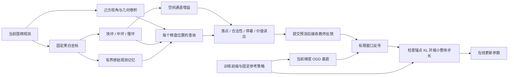

# 多环、外部记忆与在线行为保护：实现及验证

2026-09-11。核心约束保持为正交传播、环形结构和在线参数更新。本轮目标是修复已证实的可表达性缺陷，建立可证伪的历史任务，并把梯度正交连接到可测量的行为漂移。历史回忆与围棋棋力是两个不同的评价对象。

## 1. 已实现的结构



- **空间位置别名**：`GoSpatialSkipHeads(..., geometry=True, depth=2)` 加入有效棋盘、行、列、半径平方四张几何平面，并使用两层 3×3 卷积。有效棋盘平面区分补零边界与空交叉点，坐标区分相同棋子邻域。默认仍为旧版三平面、单层卷积。新增测试验证旧版空盘隐藏特征完全相同，新版能够学习中心落点。
- **记忆坐标**：空间卷积继续使用己方／对方视角；`GoResearchCore` 在注入和角度控制前转换为固定黑／白平面，并保留执棋方标量。只改变坐标，不输入合法着掩码或隐藏的超级劫历史。
- **多环**：保留三个环，默认携带率分别为 0、0.85、0.97，承担当前观测、中期与较长历史。写入尺度为 `sqrt(1-rho²)`，这是独立各向同性输入下的方差标定，不是对相关棋局输入的能量保证。
- **输入条件化正交传播**：在循环 Givens 角上添加 `s*tanh(W*x)`。控制器只看当前固定颜色观测，初始权重为零；循环邻边及首尾连接保留。完整有符号旋转用于传播，没有平方成非负矩阵。
- **按位置读取**：`PositionQueryGoAgent` 将每环相邻四个标量组成局部内容，每个棋盘点查询全部环槽。额外的通道增益保留此前有效的空间调制路径。开发实验发现只用位置查询时在线落点学习较慢，因此正式版本同时保留两条路径，并保留 FiLM 对照。位置查询与调制自身不需要正交，也不属于正交传播定理。
- **外部观测记忆**：`GoObservationMemory` 保存最多 16 个无标签观测，内容为固定黑／白棋盘、有效位与观测时间。读出时才生成坐标键和查询。先读取过去，再提交预测，最后写入当前观测；满容量后 FIFO 淘汰，开新局清空。
- **行为锚点记忆**：`GoBehaviorMemory` 另外保存已经见过的训练前缀及参考策略。它只参与 OGD 刷新和漂移检查，不向推理时的观察记忆写标签。两类记忆分别计费。

新接口在 `mqr/go_memory.py`、`mqr/go_protection.py` 中，旧类、默认参数和检查点路径保留。条件旋转配置与记忆坐标会随模型保存并在恢复时校验。Session 检查点包含参数、环状态、外部记忆、待反馈窗口、OGD、锚点参考与刷新状态。

## 2. 为什么多环与外部记忆只能解决部分问题

多环增加可用时间尺度，外部存储增加可寻址的信息，但信息存在不等于任务可用。如果所有落点共享同一个局部特征，即使添加更多环，读出仍可能相同；如果外部槽保存的是旧参数产生的隐向量，参数变化也可能改变键和值的含义。本实现分别用几何特征和原始固定坐标观测处理这两个问题。

外部记忆也不是无限历史：早期区别被 FIFO 淘汰后，当前观测和外部记忆都可能相同。独立审计比较了 2 槽和 16 槽的相同合法轨迹对，检查信息是否已丢失，而不是仅比较存储容量。

目前环内隐状态仍会跨参数更新继续携带，不能宣称它在在线参数变化下完全没有表征漂移。外部原始记忆和锚点重放避免了存储旧隐向量的问题；环隐状态跨更新的一致性仍属于后续研究问题。

## 3. 真正需要历史的任务

新增 `generate_reachable_history_pairs` 从空棋盘逐手合法构造两条轨迹：交换黑棋前两次落子的顺序，保持公共后缀。查询时，棋盘、执棋方、上一着、手数、停着计数和完整基础编码均相同。任务要求选择“黑棋第一着的中心对称点”；两个候选点都为空且合法。

这是在合法围棋轨迹上定义的**历史回忆探针**，不是最优围棋策略，也不是超级劫棋力基准。没有修改模拟器的历史集合、伪造设定盘面或用规则历史作为模型输入。

每个最终观测配两个不同答案，所以无历史模型在配对二选一上限为 50%。训练外的干预有：保留历史、清空环与外部历史、交换配对历史。若模型确实读到早期顺序，交换历史应使答案跟随被交换的历史。

正式协议使用 5 个独立种子，每个种子 96 个训练轨迹对、64 个测试轨迹对，棋盘 5×5，每条 12 着加初始观测。训练采用在线小批量反馈，批大小 16，明确重放 64 轮；它不是无重放的一次流式扫描。8 步与 32 步上限使用相同数据、批次顺序和更新次数；本任务的实际完整信用跨度为 13 个观测，不将它描述为已经验证了 32 步记忆。

## 4. 学生在线闭环与行为保护

围棋实验先在独立的教师数据上预训练同一个几何骨干，然后在学生实际导致的棋局状态上提交预测、接收教师反馈、按窗口更新。A 阶段从空棋盘开始，B 阶段加入 6 手随机合法开局；学生与教师交替执黑／执白，双方回合都提供预测后的教师反馈。

评估使用固定权重。棋力测试为 4 个随机合法开局，每个开局交换颜色，共 8 局／种子；各方法共享开局。达到手数上限的局不计作胜局，只以双停着终局判断胜负。监督信号来自本地启发式教师；本轮没有使用终局奖励强化学习，价值损失关闭。

信用跨度和更新频率已在 API 中分离：`update_every` 控制提交窗口，`credit_horizon` 控制重放图每隔多少步截断。它不会让梯度越过当前窗口，也不会通过仅增加无梯度 burn-in 来虚报信用长度。

OGD 的新流程为：

1. A 阶段按执棋顺序和前缀长短分层保存有界、已见过的完整前缀；冻结后不再吸收 B 阶段或测试数据，也不重设参考策略。
2. 在当前参数重放原始前缀，对目标和最强替代动作的对数概率求梯度。按未覆盖方向的归一化残差选取基底；正式秩预算为 8，默认每 8 次参数更新刷新。
3. 在线梯度投影后统一裁剪整体步长。对照包含普通 SGD 和按当前 OGD 投影范数缩放的 SGD，后者保留普通梯度方向。
4. 守护版本检查全部锚点最终动作分布相对 A 阶段固定参考分布的 KL。超预算时二分缩小整个候选更新，必要时回滚。统一标量缩放保持 `Q delta = 0`；没有投影后再任意改变各参数块的学习率。

本轮所有任务参数使用共同学习率，转移参数每次更新；范数匹配对照限定在这个设定。独立审计中的秩 4／8／16 是最终参数处的局部候选步实验，不把它描述为已经完成三种秩的长期围棋训练对比。

有限步约束只覆盖保存的锚点和定义好的重放前缀，不能保证未保存局面不遗忘。所有方法仍单独报告 A 阶段最终相对初始的绝对收益，避免把“比另一方法退步少”误当成能力提升。

## 5. 把理论性质连接到任务收益

对给定输入序列和相同参数序列，环满足

\[
h_{t+1}^{(r)}=\rho_r R_r(x_t;\theta_t)h_t^{(r)}+b_r(x_t),\qquad R_r^T R_r=I.
\]

当激活为恒等、两条比较路径的输入和外部写入相同时，

\[
\|\Delta h_{t+1}^{(r)}\|_2=\rho_r\|\Delta h_t^{(r)}\|_2.
\]

不同历史输入之间、不同在线反馈导致的不同参数序列之间，不能直接套用这个等式。若旋转控制器未来改成依赖隐状态，还必须重新分析控制器导数；本轮控制器严格限制为当前外生输入。

任务可读出的历史差异取决于完整映射，而不仅是状态范数：固定输入条件下的局部因子包含读出 Jacobian、旋转乘积和注入 Jacobian。实验因此同时记录配对状态距离、配对落点 logit 距离和任务准确率，并执行清空／交换干预。恒等、普通循环移位、扭转移位和 GRU 都是必要对照；当前参数化不应仅凭项目名称被宣称具有已经证明的 Möbius 拓扑收益。

对保护分数 `f_i(theta)` 和当前梯度 `g_i`，在共同坐标、正交行基底 Q 与 `Q delta=0` 条件下，

\[
|f_i(\theta+\delta)-f_i(\theta)|
\leq \|(I-Q^TQ)g_i\|_2\,\|\delta\|_2
+\tfrac12 L_i\|\delta\|_2^2.
\]

这要求更新邻域内存在对应 Hessian 范数上界 `L_i`；代码没有宣称已估计出全局上界。梯度重算降低第一项中的失配，有限步 KL 检查直接测量选定行为是否漂移。秩审计比较真实有限步变化、一阶预测与 Taylor 余项，而不是以基底正交误差代替任务收益。

OGD 的一阶保护依据可参阅 [Farajtabar 等，2020](https://proceedings.mlr.press/v108/farajtabar20a.html)。学生导致的数据分布需要持续接收监督的动机可参阅 [Ross 等，2011](https://proceedings.mlr.press/v15/ross11a.html)。本项目的 FIFO 原始记忆、当前梯度刷新与有限锚点 KL 检查是这里的具体工程组合，不将组合本身宣称为已获证明的全新算法突破。

## 6. 可复现入口

```bash
python3 -m py_compile mqr/*.py
python3 test_go_memory.py
python3 test_go_online_session.py

python3 experiments/go_memory_research.py --study history \
  --seeds 239,263,293,317,349 --history-epochs 64 \
  --history-train-pairs 96 --history-test-pairs 64 \
  --output analysis/results/go_memory_history_5seed.json \
  --checkpoint-dir checkpoints/go_memory_v2_confirmed

python3 experiments/go_memory_research.py --study online \
  --seeds 239,263,293,317,349 \
  --methods frozen,spatial,film,identity,orthogonal,orthogonal_ogd,orthogonal_norm,orthogonal_guard,conditional_external_guard \
  --pretrain-epochs 24 --train-games 8 --test-games 8 --match-games 8 \
  --output analysis/results/go_memory_online_5seed.json \
  --checkpoint-dir checkpoints/go_memory_v2_confirmed

python3 analysis/go_memory_verify.py
python3 analysis/go_memory_mechanisms.py

python3 experiments/play_memory_go.py \
  checkpoints/go_memory_v2_confirmed/conditional_external_guard-239.pt \
  --games 4 --save checkpoints/go_memory_v2_confirmed/continued-239.pt \
  --output analysis/results/go_memory_continuation.json
```

测试无需下载数据。检查点保存在 Git 忽略目录，不随代码提交。开发试验保留为 `*_development.json`，不混入正式表格。早期棋力开发协议包含重复的确定性开局，正式协议已经修正为随机开局换色；正式种子在此修正后重新选取。

历史研究通过原始数据重建、训练／测试轨迹哈希及历史干预验证。围棋研究通过重放所有保存棋谱、检查终局计数和对齐各方法开局验证。JSON 中保存全部运行配置和核心源文件 SHA-256；旧版历史证据保持原样，不把旧结果伪装为新实现的成绩。

## 7. 五种子结果

以下为种子 239、263、293、317、349 的均值。完整逐种子结果和描述性 bootstrap 区间见 [汇总 JSON](results/go_memory_summary.json)。每个种子的配对数据在各方法间复用，不能把方法数乘进独立样本量。

### 7.1 历史读出

| 方法 | 历史准确率 | 逐种子范围 | 清空历史 | 可训练参数 | 观察记忆 B |
|---|---:|---:|---:|---:|---:|
| 无历史 | 50.00% | 50.00%–50.00% | 50% | 4734 | 0 |
| 恒等多环 | 86.88% | 52.34%–100.00% | 50% | 4734 | 0 |
| 普通移位 | 90.00% | 50.00%–100.00% | 50% | 4734 | 0 |
| 扭转移位 | 100.00% | 100.00%–100.00% | 50% | 4734 | 0 |
| 固定正交环 | 100.00% | 100.00%–100.00% | 50% | 4734 | 0 |
| GRU | 50.00% | 50.00%–50.00% | 50% | 8094 | 0 |
| 学习正交环，信用 8 | 50.78% | 50.00%–52.34% | 50% | 4766 | 0 |
| 学习正交环，完整信用 | 90.00% | 50.00%–100.00% | 50% | 4766 | 0 |
| 条件正交环 | 100.00% | 100.00%–100.00% | 50% | 7358 | 0 |
| 无循环历史＋外部记忆 | 62.97% | 50.00%–78.91% | 50% | 4814 | 3328 |
| 条件正交环＋外部记忆 | 100.00% | 100.00%–100.00% | 50% | 7438 | 3328 |

所有方法的清空历史准确率均为 50%。达到 100% 的方法交换历史后均降到 0%；模型确实随历史改变答案。固定正交环和扭转移位也达到 100%，所以不能把成功全部归因于学习旋转或外部记忆。

完整信用相对 8 步信用的正交环提升为 **39.22 个百分点**，五种子配对描述性 bootstrap 区间约为 **19.53–49.69 个百分点**。相对恒等环的平均提升只有 3.13 个百分点，区间跨零。条件旋转本轮避免了一个种子的失败，但固定结构对照同样满分；它不是条件旋转独特必要性的证明。

历史探针使用 Adam、小批量预测后更新和明确的 64 轮训练数据重放，用于检验可训练的历史读出与信用分配。它不是“一次扫描、无重放、事务式 OGD 在线学习已达 100%”的证据。部署式教师反馈闭环采用下面独立的 `GoOnlineSession` 事务更新实验。

### 7.2 学生导致的围棋状态与在线适应

B 收益 = B 阶段前 NLL − B 阶段后 NLL，越大越好。A 变化 = B 阶段后 A NLL − B 阶段前 A NLL，负数表示继续改善。A 最终收益相对整个在线训练前的初始模型计算。

| 方法 | B 收益 | B 阶段 A 变化 | A 最终收益 | 终局胜场 / 40 |
|---|---:|---:|---:|---:|
| 冻结模型 | +0.0000 | +0.0000 | +0.0000 | 3/40 |
| 直接微调空间骨干 | +0.1594 | -0.0934 | -0.0656 | 17/40 |
| 正交环＋FiLM | -0.0320 | +0.0049 | +0.1741 | 14/40 |
| 恒等环＋位置查询 | +0.0285 | -0.0214 | +0.1691 | 13/40 |
| 正交环＋位置查询 | -0.0005 | +0.0002 | +0.1784 | 16/40 |
| 正交环＋刷新 OGD | +0.0352 | -0.0188 | +0.1973 | 12/40 |
| 正交环＋同范数 SGD | +0.0622 | -0.0205 | +0.1991 | 13/40 |
| 正交环＋OGD＋KL 守护 | +0.0352 | -0.0124 | +0.1909 | 13/40 |
| 条件正交环＋外部记忆＋守护 | +0.0291 | -0.0096 | +0.1893 | 13/40 |

40 局／方法均真实终局；这些结果只涉及启发式教师、5×5 棋盘及本协议。冻结基线 3/40，正交环在线适应 16/40，直接微调空间骨干 17/40。因此已经看到整体在线适应收益，但没有建立环方法优于直接微调的证据。守护版本更严格地限制了锚点行为，胜场并未超过普通适应。

纯正交环 B 总 NLL 收益接近零，但非停着落点 NLL 改善约 0.0308；停着部分恶化抵消了它。各部分损失已分别保存在 JSON，不能只看总 NLL 或单一组件。

### 7.3 行为约束与存储成本

| 方法 | 可训练参数 | 峰值在线持久张量 KiB | 锚点 KiB | OGD KiB | 最大锚点 KL |
|---|---:|---:|---:|---:|---:|
| 直接微调空间骨干 | 2140 | 13.4 | 0.0 | 0.0 | 0.000000 |
| 正交环＋位置查询 | 2626 | 13.4 | 0.0 | 0.0 | 0.000000 |
| 正交环＋刷新 OGD | 2626 | 136.8 | 41.3 | 82.1 | 0.103202 |
| 正交环＋同范数 SGD | 2626 | 136.8 | 41.3 | 82.1 | 0.316375 |
| 正交环＋OGD＋KL 守护 | 2626 | 136.8 | 41.3 | 82.1 | 0.010000 |
| 条件正交环＋外部记忆＋守护 | 5298 | 697.3 | 485.8 | 165.6 | 0.009935 |

观察记忆自身为 3,328 B；混合模型的主要增量来自更宽的待反馈输入和保存这些上下文的行为锚点。当前锚点存储完整输入快照，包含重复的观察记忆内容，有进一步压缩空间。表中的持久张量不包括模型参数、Python 对象和临时 autograd 图；不是操作系统峰值 RSS。没有做参数量、计算量和总内存的严格配平。延迟包含棋规、教师查询、反传和守护检查，且在共享 CPU 上测量，不作独立部署性能承诺。

正交环＋刷新 OGD 的最大参考策略 KL 为 0.103202；同范数 SGD 为 0.316375；加入有限步守护后为 0.010000（配置上限 0.01，浮点容差 1e-7），5 个种子合计 53 次触发缩步。混合模型为 0.009935，触发 51 次。这里直接验证的是保存行为的漂移，而非仅验证基底正交。

## 8. 秩、有限步与在线恢复审计

独立读取 10 个最终检查点，对每个模型的已见 B 窗口测试秩 4、8、16，以及普通 SGD、OGD、同范数 SGD，共 90 个局部候选更新；检查点文件哈希全部保持不变。下表是每个检查点“最大锚点步间 KL”的跨检查点平均值，参考点是候选更新前的参数；不同于上表累计相对 A 阶段的 KL。

| OGD 秩预算 | 梯度能量覆盖 | OGD 步间 KL | 同范数 SGD 步间 KL | OGD 的 B 局部损失收益 |
|---|---:|---:|---:|---:|
| 4 | 72.28% | 0.0016217 | 0.0042396 | 0.02600 |
| 8 | 96.02% | 0.0001086 | 0.0026879 | 0.01859 |
| 16 | 100.00% | 0.0000095 | 0.0021584 | 0.01504 |

秩 8 时，OGD 与范数对照的平均步长相同，锚点步间 KL 约为 0.000109 与 0.002688。说明本局部审计中的保护不只是步长变小。秩 16 对所选目标方向的一阶漂移接近数值零，但有限步漂移仍不为零，且新数据损失改善较小；二阶项和可塑性代价必须保留在解释中。

外部记忆淘汰审计中，2 槽（416 B）在 12 手后使配对查询输入完全相同，16 槽（3,328 B）仍保留差异。存储系统只有在保留了任务需要的信息、且查询实际能读取它时才有作用。

从混合模型检查点继续实际在线对局 4 局：158 次反馈、22 次参数更新、18 次锚点缩步，最大 KL 为 0.0099989，4 局均终局、0 胜。连续 4 局与分两次各 2 局的棋谱和全部 71 个 Session 张量字段完全一致，见 [恢复验证](results/go_memory_resume_verify.json)。

## 9. 当前结论与下一步优先级

已解决的是新版结构中的空盘空间别名、跨执棋方的记忆坐标翻转、历史任务缺失、更新频率与信用长度混淆，以及缺少实际锚点漂移检查的问题。多环和原始外部记忆已能与在线事务、恢复和 OGD 一起运行。

尚未解决的是正交环相对强而简单的对照的独特性能优势。条件正交环已经把本历史任务做到满分，加入外部记忆没有增加准确率；围棋中混合模型也没有比无外部记忆的守护模型多赢，持久张量开销却明显增加。当前应将外部记忆保持为可选结构，不能以增加存储量代替算法收益证明。

保护对象本身也需要有价值：固定参考策略可能包含弱模型的错误，压低其 KL 不一定提高棋力。本轮证明了这些已保存行为的漂移可测且可约束，没有证明每一次被阻止的漂移都是有害遗忘。后续锚点选择还应连接正确率、价值或明确的旧任务约束。

后续理论与实验优先检验：更长延迟和多次按位置查询时，哪个历史差异会落入任务读出的零空间；固定正交传播何时不足而条件旋转能提供额外收益；受保护锚点的梯度覆盖与真实策略漂移如何共同决定容量及步长；压缩锚点中的重复历史后，在相同总预算下能否优于直接微调和固定移位。真正的超级劫任务、终局价值／搜索训练和更大棋盘，需要分别建立证据，不能由本轮回忆探针替代。

## 10. 代码与证据保护

代码通过 CodeRecoder 原生引擎建立修改前和实现后快照，并独立校验；不是只用 Git 代替备份，也未声称启用了持续监听。修改前快照为 `118098f8-4c7e-449b-9edc-ff92364151a5`，实现后快照为 `0a98afdf-3e87-4191-b4c0-a1ca718eb5dd`。最终交付再建立一次独立校验快照。

回归检查共 **139 项测试通过**，另通过数学校验、离线 Digits 实验和 quick_start；具体命令及日志哈希见 [检查记录](results/go_memory_checks.json)。正式结果审计重建历史配对，验证全部 55＋45 组运行的源码出处，并合法重放 1080 份棋谱。

审计发现并修复了 FiLM 对照遗漏合法性策略权重的问题：实验驱动版本 `8ed4a93` 保留原始运行；`f3e0ba2` 只为 FiLM 构造器补上 `legality_policy_scale=1.0`，重跑全部五个 FiLM 种子。最终 JSON 逐运行记录实际源码修订；修正前数据单独存档。其它方法执行分支没有改变。

新增接口一致性测试还发现预览曾绕过位置查询，返回旧的全局头。当前 `preview_step` 已与 `commit_step` 共用 `_transition`，并通过回归。上述实验使用提交路径或直接重放，不调用预览；验证器在核对记录的 Git 源码后，额外检查当前核心 AST 除该预览分派修复外与实验版本相同。不会把历史运行的源码哈希改写成从未执行过的版本。
