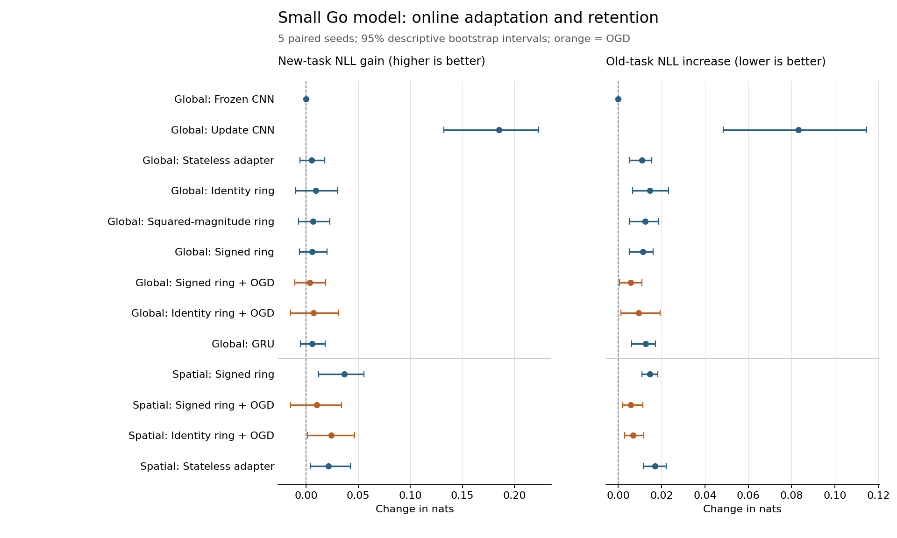

# 正交环形网络与围棋在线学习：工程审查及优化

日期：2026-09-09。核心约束：保留正交变换、环形状态演化、在线学习更新。本文是工程与探索性实验报告，不是独立算法优势或棋力突破的宣告。

本轮已实现有符号正交环、有限窗口在线反馈、当前参数下的 OGD 记忆重建、空间特征调节及真实对局保存恢复。五种子实验中，OGD 将全局/空间版本的旧任务 NLL 增幅分别降低约 **50% / 61%**，代价是新任务适应减弱。正交环尚未超过 identity 对照，也没有可靠棋力提升。最有价值的后续假设是：用正交环扩大低秩写入的有效历史容量，再让围棋任务明确检验这种容量是否被使用。

## 1. 当前工程的判断

项目已经具备扎实的机制实现，但此前的实验没有证明环结构带来独立性能优势。当前最值得优化的是**历史信息如何影响二维决策、未来错误如何训练过去的写入，以及在线更新究竟保护什么**。继续叠加数学约束不会自动解决这些问题。

| 层次 | 当前实现 | 已有价值 | 主要限制 |
| --- | --- | --- | --- |
| 参数几何 | `mqr/unitary.py`，Cayley、cyclic Givens | 酉性可验证；Givens 有真实首尾邻接 | 模平方传播会丢掉符号/相位；稠密 Cayley 有立方求解成本 |
| 固定点推理 | `mqr/ring.py` | 收敛性、伴随梯度、有限求解证书 | 收敛会抹去初始状态；线性稳态仍是输入的线性映射 |
| 外部时间记忆 | `mqr/temporal.py` | 每次观察推进一次，多时间尺度、状态恢复 | 每个环反复混合并非无损存储；强写入和激活饱和会削弱历史信用 |
| 正交梯度系统 | `mqr/online.py` | 支持完整参数布局、不同学习率白化、稀疏块约束 | 保护的是有限个历史方向的一阶变化，不是全部旧任务性能 |
| 在线 Agent | `mqr/agent.py` | 四头、延迟票据、轨迹级反馈、原子更新 | 单票据反馈截断早期写入的信用；utility 写门可能与任务学习形成自举困难 |
| 地址与内容 | `mqr/routing.py` | 无写时内容可保持，预算和上下文路由可审计 | 历史结果与强稀疏置换基线持平，不能把路由收益归因于量子形式 |
| 围棋测量 | `mqr/go.py`、`go_agent.py`、Sayuri 桥 | 真正合法棋盘、提子、超级劫、独立引擎教师 | 教师一致、原始合法率、外部约束后胜率测量的是不同能力 |
| 小语言模型 | `mqr/minicpm.py` | 冻结 MiniCPM、LoRA 与上游特征梯度接通 | 已有结果主要证明链路，不能据此声称语言模型通用能力增强 |

已有 10×10/13×13、10-seed 等资源研究的历史焦点准确率为 0.5，部分比较中 MQR 与 identity 完全持平。原研究将总状态限制在 48 B，有助于公平审计，却不足以默认承担完整棋盘历史。详情保留在 [历史正式报告](mqr_formal_competitive_go_report.md)，本轮不会追溯改写其负面结论。

另一个容易误读的问题是 `generate_go_agent_trajectories` 的 `winner/value_target`：生成器在记录步数上限处调用面积计分，棋局不一定终止。已修正文档。本轮不使用这些值训练价值头；真实对局只有两次停手后才记录终局胜负，达到步数上限只报告截断面积差。

## 2. 三种正交性必须分开

**连接参数的酉性**是 \(U^\dagger U=I\)。**状态传播的正交性**要求真正用 \(R\) 满足 \(R^TR=I\)。**更新方向的正交性**则是 \(g_{old}^T\Delta\theta=0\)。这三者分别作用于参数表示、状态信息、参数更新，不能互相替代。

对于 \(H=|U|^2\)，行列和为 1，但一般 \(H^TH\ne I\)。它具有稳定的平均化作用，却不普遍保持状态 L2 范数。尤其在单位阵附近，实 Givens 旋转

\[
R(\theta)=\begin{bmatrix}\cos\theta&-\sin\theta\\\sin\theta&\cos\theta\end{bmatrix}
\]

满足 \(R'(0)\ne0\)，但 \((R\odot R)'(0)=0\)。因此直接保留符号可以消除这一特定初始化点的模平方一阶退化。它不能保证所有参数都有非零有效梯度，也不能消除输入、读出或损失造成的零空间。

单位/酉递归网络和 OGD 都有既有研究基础，不能把使用这些部件本身当作新颖性。这里探索的是它们与有限反馈窗口、空间读出和持续适应的组合。[Unitary Evolution RNN 原论文](https://proceedings.mlr.press/v48/arjovsky16.html)、[OGD 原论文](https://proceedings.mlr.press/v108/farajtabar20a.html)。

## 3. 已实现的结构优化

### 3.1 直接有符号的正交环

`CyclicGivensUnistochasticParam.apply_orthogonal` 按相邻配对直接作用于状态，包含 `(N-1, 0)` 的环首尾边。它与稠密的 \(hR^T\) 及其梯度一致，支持逆方向传播，计算量为 \(O(BLN)\)，无需每步构造 \(N\times N\) 矩阵。

`MultiTimescaleMQR` 新增 `transition_mode="orthogonal"`，需配合 `transition_structure="cyclic_givens"`。旧 `identity/unistochastic` 默认语义保持不变；同时去除了 identity 对照中不必要的单位阵乘法。

新模式传播的是带符号矩阵。其 L2 约束成立，但不满足双随机和普遍的 L∞ 非扩张约束。可选状态证书仍使用实际矩阵的 L∞ 增益，而不把它错误设成 1；`max_stochastic_error` 不应作为正交模式的通过门。

### 3.2 分离衰减、写入和激活

本轮环控制使用

\[
h_{j,t}=\rho_j R_jh_{j,t-1}+\kappa_jJ_j(x_t),\qquad
\rho_j\in\{0,0.85,0.97\},\quad
\kappa_j=\sqrt{1-\rho_j^2}.
\]

注入保留非线性，状态递归使用线性激活，读出保留非线性。相同外部输入下，两条状态轨迹满足

\[
\|h_t-\widetilde h_t\|_2=\rho^t\|h_0-\widetilde h_0\|_2.
\]

若写入满足 \(\|J(x_t)\|_2\le B\)，则

\[
\|h_t\|_2\le\rho^t\|h_0\|_2+
\kappa B\frac{1-\rho^t}{1-\rho}.
\]

只有在写入零均值、各向同性、与先前状态不相关等假设下，\(\kappa=\sqrt{1-\rho^2}\) 才对应单位平稳协方差。实际注入秩 8 小于状态维度 16，单步写入协方差甚至不能是满秩单位阵；围棋输入还有时间相关性。故这里只把它用作尺度初始化，不能宣称实际状态能量守恒。

### 3.3 有限轨迹信用分配

`GoOnlineSession` 的流程是 `observe → feedback → flush`。`observe` 的参数版本和输出在标签到达前固定。默认累计 8 次观察，重放同版本连续轨迹，随后只提交一次更新。这能使后续错误训练窗口内更早的输入注入和旋转参数。窗口之前的状态仍然 detach，因而它是**有界 BPTT 的在线系统**；不能称为完整无限历史梯度，也不能称为所有更新都无需 BPTT。

学习状态跨更新保留，棋局之间重置。未完成反馈不能被静默丢弃；保存恢复包含模型、OGD、状态和未完成票据。接口兼容现有 `TemporalUtilityMQRAgent` 的更新和回滚路径。

### 3.4 用当前行为重建正交记忆

在 A 阶段结束后，用已见训练窗口、当前参数重算末步教师动作的 log-probability 梯度。记忆存储这些梯度的正交基，而不是一直保护训练开始时前几个尚未学好的损失方向。测试集不会参与记忆构建。

令 \(D\) 为学习率对角阵，记忆基为 \(Q\) 的行，更新为

\[
\Delta\theta=-\sqrt D(I-Q^TQ)\sqrt D\nabla L_{new}.
\]

记忆方向满足一阶正交，实际旧输出仍可能出现二阶漂移、锚点外变化及长期梯度过时。SGD 更新后不能再任意叠加动量或权重衰减而沿用该正交保证。本轮使用无动量的显式更新，并计入重建梯度的额外开销。

### 3.5 用环状态调节空间特征

`SpatialRingGoAgent` 提供独立可选的空间读出：

\[
F_t'=F_0(x_t)\odot(1+\gamma(z_t))+\beta(z_t),
\qquad z_t=\operatorname{readout}(h_t).
\]

调节层零初始化，所以初始预测与冻结空间网络完全一致。在线时只训练环与调节层，冻结基网络；不再依赖全局的逐点偏置来表达局部棋形修正。正交约束施加在递归传播上，\(\gamma/\beta\) 本身不是正交变换。该变体会单独报告，不能在看到结果后与全局读出混合挑选最优数值。

## 4. 围棋评测协议及其解释

本轮使用 5×5 棋盘、2.5 贴目，正交环维度 16、三个时间尺度、潜变量 16，公共空间网络为 16 通道的微型卷积模型。开发种子为 7；后续固定比较使用 `17,29,43,71,101`，没有按这些种子的测试结果调参。

公共基网络先在独立的 24 局前缀上训练 8 轮。A 阶段接收从开局开始的 24 个轨迹，B 阶段接收带 12 步随机前缀的 24 个轨迹，每条最多记录 24 步。A/B 各有独立种子的 16 个测试轨迹；检查完整轨迹不与训练完全重复，但不同对局仍可能共享开局和局部棋形。这是按对局划分的测试，不是所有棋盘局面都未见的测试。

九个全局读出对照包括：冻结模型、只训练空间网络、无记忆适配器、identity 环、模平方环、有符号正交环、正交环+OGD、identity+OGD、GRU。空间调节变体另外比较正交环、正交环+OGD、identity+OGD、无记忆控制。OGD 默认 rank 16；全部主训练样本和更新次数相同，OGD 锚点梯度是额外成本。

主要指标是：先预测时的 NLL、未更新测试集的 NLL/教师一致率、A→B 后 A 的 NLL 增量、重置历史后的变化，以及配对颜色/开局的真实对局结果。参数、递归状态、待反馈张量和 OGD 内存分别统计，不能只用 192 B 的环状态代表整个在线系统内存。运行耗时包含并发实验造成的 CPU 竞争，仅作工程记录，不用于严格速度排名。

训练标签来自确定性的本地战术教师。独立对局使用同一固定对手，支持单独启动 Sayuri。外部规则器保证执行动作合法；同时记录原始动作合法率和非法概率质量。掩码后 100% 合法不代表模型学会规则，教师一致率也不等于搜索能力或棋力。

当前规则是面积计分、禁自杀、情境超级劫、停手豁免重复检查、两次停手结束，不做死子争议裁决。应称为本项目定义的围棋规则变体，不能不加区分地等同所有中国规则实现。[KataGo 的规则说明](https://lightvector.github.io/KataGo/rules.html)也明确区分计分、劫规则和清理阶段。

## 5. 已验证的理论与工程结果

### 5.1 数学与实现不变量

`analysis/orthogonal_ring_verify.py` 在 float64 下得到：

| 检查 | 实测值 |
| --- | ---: |
| 单位阵处有符号旋转梯度范数 | 2.455064 |
| 同点模平方传播梯度范数 | 0 |
| 正交矩阵误差 | 4.28e-16 |
| 理想各向同性平稳协方差恒等式误差 | 2.22e-16 |
| 32 步有阻尼范数公式误差 | 6.66e-16 |
| 不同学习率下 OGD 一阶内积最大绝对值 | 4.86e-17 |

这些数值支持结构与局部梯度公式，不是棋力结果。十套测试覆盖原有行为、稀疏/稠密梯度一致、历史信用路径、冻结基网络不变、反馈顺序和中途恢复。

低秩写入还给出一个可检验的结构解释。对线性状态系统，有限历史的可到达矩阵为

\[
\mathcal C_T=[B,\rho RB,(\rho R)^2B,\ldots,(\rho R)^{T-1}B].
\]

当 \(R=I\) 时，其秩不超过 \(B\) 的秩；旋转可以将不同时间的写入映射到不同子空间。在固定种子、状态维度 8、注入秩 4、\(\rho=0.97\)、32 步的诊断中：

| 传播算子 | 可到达秩 | 最小/最大奇异值比 |
| --- | ---: | ---: |
| identity | 4 | 1.30e-16 |
| 模平方 Givens | 8 | 0.05460 |
| 有符号 Givens | 8 | 0.46663 |
| 普通循环移位 | 8 | 0.53065 |
| 首尾翻号的 Möbius 移位 | 8 | 0.50842 |

这说明正交传播可能提高低秩历史写入的覆盖和数值条件，也说明简单移位必须成为强对照。满秩并不代表可以从有限状态中无损恢复任意长输入；这个样本也不能证明所有正交矩阵都比模平方矩阵条件更好。首尾翻号移位满足 \(R^8=-I\)，本轮只在数学诊断中验证，尚未作为新的围棋结构训练。原始值见 [理论诊断 JSON](results/orthogonal_ring_verification.json)。

### 5.2 五种子对照：保持收益与适应代价

以下 `B NLL 改善 = 学习前 B NLL − A/B 学习后 B NLL`，越大越好；`A 遗忘 = B 学习后 A NLL − A 学习后 A NLL`，越小越好。B 的改善包含整个 A→B 学习过程，不能解释为只由 B 阶段产生的收益。区间是跨五个配对种子的 10,000 次重采样百分位区间，属于探索性描述，不是跨任务普遍保证；没有对多项比较做校正。

| 全局读出方法 | B NLL 改善均值 | 95% 描述性区间 | A 遗忘均值 |
| --- | ---: | --- | ---: |
| 冻结空间网络 | 0.00000 | [0.00000, 0.00000] | 0.00000 |
| 在线更新空间网络 | 0.18499 | [0.13236, 0.22344] | 0.08320 |
| 无记忆适配器 | 0.00537 | [-0.00592, 0.01768] | 0.01092 |
| identity 环 | 0.00915 | [-0.00983, 0.03039] | 0.01461 |
| 模平方环 | 0.00675 | [-0.00730, 0.02257] | 0.01240 |
| 有符号正交环 | 0.00581 | [-0.00629, 0.01986] | 0.01132 |
| 有符号正交环 + OGD | 0.00343 | [-0.01098, 0.01847] | 0.00569 |
| identity 环 + OGD | 0.00682 | [-0.01506, 0.03108] | 0.00944 |
| GRU | 0.00556 | [-0.00565, 0.01824] | 0.01258 |

全局正交环加入 OGD 后，A 遗忘均值降低 `0.005634`，配对区间 `[0.002569, 0.008797]`，相当于原均值的 49.8%。但 B 的改善较小、区间跨零；对 identity+OGD 的 B 优势为 `-0.003385 [-0.012492, 0.004590]`，未建立旋转独立优势。直接更新空间网络对新任务的改善远大于所有全局适配器，同时遗忘也更大，提示当前适配器的空间表达与保护目标需要一起改进。

| 空间调节方法 | B NLL 改善均值 | 95% 描述性区间 | A 遗忘均值 |
| --- | ---: | --- | ---: |
| 有符号正交环 | 0.03681 | [0.01187, 0.05533] | 0.01459 |
| 有符号正交环 + OGD | 0.01014 | [-0.01475, 0.03385] | 0.00574 |
| identity 环 + OGD | 0.02392 | [0.00133, 0.04629] | 0.00683 |
| 无记忆适配器 | 0.02145 | [0.00401, 0.04265] | 0.01685 |

空间版本加入 OGD 后，A 遗忘降低 `0.008843 [0.004563, 0.014556]`，约 60.6%，但 B 改善从 `0.03681` 降到 `0.01014`。带 OGD 的正交环在 B 上弱于 identity+OGD，配对优势为 `-0.013781 [-0.020329, -0.005652]`。无 OGD 的正交环重置历史后 B NLL 增加 `0.019509 [0.000114, 0.032794]`，说明这个版本确实利用了历史；这不能单独把收益归因于正交性。



完整数据：[全局五种子](results/orthogonal_go_online_5seed.json)、[空间五种子](results/orthogonal_go_online_spatial_5seed.json)；配对计算及逐局规则重放：[全局审计](results/orthogonal_go_online_5seed_audit.json)、[空间审计](results/orthogonal_go_online_spatial_5seed_audit.json)。种子 7 的 `development` 文件仅用于开发，未混入这些汇总。

### 5.3 资源成本和棋力边界

| 结构 | 可训练参数 / 总参数 | 递归状态 | OGD 基 | 训练阶段在线张量峰值 |
| --- | ---: | ---: | ---: | ---: |
| 全局正交环 | 2732 / 3309 | 192 B | 0 | 15592 B |
| 全局正交环 + OGD | 2732 / 3309 | 192 B | 174848 B | 190440 B |
| 全局 identity + OGD | 2700 / 3277 | 192 B | 172800 B | 188392 B |
| 空间正交环 | 2360 / 3821 | 192 B | 0 | 15592 B |
| 空间正交环 + OGD | 2360 / 3821 | 192 B | 151040 B | 166632 B |
| 空间 identity + OGD | 2328 / 3789 | 192 B | 148992 B | 164584 B |

公共空间基网络为 528 参数；空间变体保留但冻结了旧全局头，因此总参数包括这些未使用的兼容参数。在线张量峰值含状态、历史输入、待反馈票据、反馈和 OGD，按底层存储去重；不包含模型参数、autograd 临时量或 Python 对象，也不是进程 RSS。表中数值在五个种子上相同。OGD 的基存储按 `rank × 可训练参数 × 4 B` 增长，远大于递归状态，不能称为“整个在线系统仅需 192 B”。

正交环核心前向估算为 1928 MAC，identity 为 1800 MAC；此估算不含完整空间读出、Python 调度和反向开销。所有方法共享输入与主反馈预算，但**没有严格匹配全部参数、总算力和峰值内存**，尤其 GRU、可训练空间网络和 OGD 的成本不同。本轮用于定位机制与取舍，尚不是严格同资源优胜证明。

每个结构在五个种子上分别有学习前/后各 40 局、配对颜色与开局、冻结参数的评测。全局正交环+OGD 学习后为 `0/40` 胜，空间正交环无 OGD 为 `1/40` 胜，空间正交环+OGD 为 `0/40` 胜；这些组的 40 局均正常终止。对应胜负不能被教师一致率替代。空间正交环的面积差改善 `1.075 [-0.625, 2.950]`，区间跨零；全局正交环+OGD 为 `0.200 [-0.850, 1.375]`，同样未建立优势。全局正交环+OGD 的 B 测试原始动作合法率约 `90.41%`，合法动作掩码仍在承担剩余规则约束。

### 5.4 真实在线对局与恢复

真实对局入口采用种子 17 的全局正交环+OGD checkpoint。模型在双方轮次都先预测、再接收教师标签，学生轮次执行更新前的模型动作，对手轮次执行固定教师动作。与固定轨迹实验不同，后续局面会受到学生行为影响。

| 运行 | 正常终止局数 | 标签数 | 参数更新数 | 参数版本 | 胜局 |
| --- | ---: | ---: | ---: | --- | ---: |
| 本地教师在线对局 | 4 | 146 | 21 | 140 → 161 | 0 |
| 从保存状态继续 | 2 | 73 | 10 | 161 → 171 | 0 |
| 同一起点接入 Sayuri 策略教师 | 2 | 49 | 7 | 140 → 147 | 0 |

合计 8 局、268 次反馈、38 次参数更新；均为实际两次停手结束，没有用截断计分制造胜负。`analysis/live_online_go_verify.py` 从棋盘初态逐步重放动作，重算合法性、终局面积差、反馈窗口和版本连续性，[审计结果](results/live_online_go_audit.json)通过。重放审计不会重新计算神经网络预测；反馈因果顺序和中途精确恢复另由单元测试验证。这是运行链路证据，全部告负的在线训练局不能当作独立棋力测试。

## 6. 可运行入口

```bash
# 先建立一个独立的代码保护检查点；调用本地 CodeRecoder 内核。
node scripts/code_protect.mjs snapshot --name before-go-research

# 小模型共同预训练 + 有限窗口在线学习 + 明确对照。
python3 experiments/orthogonal_go_online.py \
  --seeds 17 --methods frozen orthogonal orthogonal_ogd identity_ogd spatial_sgd \
  --checkpoint-dir checkpoints/orthogonal_go_online \
  --output analysis/results/my_orthogonal_go_run.json

# 对局中继续学习，教师标签在模型预测后才到达。
python3 experiments/play_online_go.py \
  --checkpoint checkpoints/orthogonal_go_online/orthogonal_ogd-17.pt \
  --games 8 --save-to checkpoints/live_go.pt

# 恢复到下一局；可加 --teacher sayuri 使用本地已安装的独立引擎。
python3 experiments/play_online_go.py \
  --checkpoint checkpoints/live_go.pt --games 8 \
  --save-to checkpoints/live_go.pt

# 可选空间调节读出，单独生成结果。
python3 experiments/orthogonal_go_online.py \
  --readout spatial --seeds 17 \
  --methods orthogonal orthogonal_ogd identity_ogd stateless \
  --checkpoint-dir checkpoints/orthogonal_go_spatial \
  --output analysis/results/my_spatial_go_run.json
```

这是教师监督的在线学习；真实对局入口并未用胜负奖励训练策略梯度。MiniCPM 原有桥保持可用，本轮新增的性能实验针对 CPU 小型围棋网络，不能外推成 MiniCPM 性能提升。

本轮检查命令如下，数据集和默认教师均无需联网：

```bash
python3 -m py_compile mqr/*.py experiments/orthogonal_go_online.py experiments/play_online_go.py
python3 test_mobius_model.py
python3 test_online_learning.py
python3 test_temporal_mqr.py
python3 test_utility_mqr.py
python3 test_unified_mqr_agent.py
python3 test_go_minicpm.py
python3 test_routed_memory.py
python3 test_competitive_go.py
python3 test_orthogonal_ring.py
python3 test_go_online_session.py
python3 analysis/mqr_proof_verify.py
python3 analysis/orthogonal_ring_verify.py
python3 quick_start.py
python3 analysis/orthogonal_go_online_verify.py analysis/results/orthogonal_go_online_5seed.json
python3 analysis/orthogonal_go_online_verify.py analysis/results/orthogonal_go_online_spatial_5seed.json
python3 analysis/live_online_go_verify.py \
  analysis/results/live_online_go_17.json \
  analysis/results/live_online_go_resumed_17.json \
  analysis/results/live_online_go_sayuri_17.json
python3 analysis/plot_orthogonal_go_results.py
```

## 7. CodeRecoder 与代码保护

用户要求后首先调用 CodeRecoder 3.0 的生产内核创建外部快照。发现了其快照清单生成使用 `localeCompare`、读取验证却使用词法序的缺陷，混合大小写、下划线和 Unicode 文件名可触发“已生成但重读失败”。已在相邻 CodeRecoder 工程将清单排序改成与验证一致的顺序，增加确定性回归测试并构建通过；备份相关 10 项测试通过。

临时 MCP 自动会话出现锁竞争，后续改用 `scripts/code_protect.mjs` 创建明确的阶段快照，每次均调用 `verifyBackup` 独立重读和校验。该入口只支持 snapshot/status/verify，不执行恢复或删除，不声称后台自动保护持续运行。外部存储为 `~/CodeRecoderBackups/mqr-research/` 下的工程专用目录。`--coderecoder-root` 和 `--storage-root` 可覆盖默认路径；CodeRecoder 必须已构建。

相邻 CodeRecoder 工程的修复属于本机工具修复，未混入 MQR 的 Git 提交。既有源码、论文修改和本机配置均未被重置；GitHub 工程检查点 `04087d0` 已先推送。模型 checkpoint、下载权重和生成 PDF 不纳入这次源码提交。

## 8. 后续理论探索的优先顺序

1. **输入条件化的正交转移。** 用只依赖当前观察的低秩控制器输出 Givens 角度，使 \(R(x_t)\) 保持正交，但不再是固定线性滤波器。对同一输入序列仍有 L2 收缩，且非交换矩阵乘积可编码事件顺序。这是下一步可检验的假设，尚未实现；若角度依赖状态本身，额外 Jacobian 项必须重新证明，不能沿用本轮界。
2. **把围棋历史需求单独测出来。** 固定战术教师大部分行为由当前棋盘决定，普通对局对长期记忆的需求很弱。应增加自然形成的劫历史、相同棋盘不同合法历史、隐含对手风格与切换，而保持规则和反馈预算一致。用移除/打乱历史后的性能变化检验模型是否真的使用了环。
3. **扩大空间表达而不是盲目扩大稠密环。** 空间调节已实现，但全局通道调节仍然有限。下一步可研究局部共享低秩卷积与环的交互，必须保留无历史、identity、同预算 GRU 与 replay 对照，不能把额外可训练卷积的收益记作正交环收益。
4. **让 OGD 保护可更新、可测量的行为。** 当前阶段重建解决了早期梯度过时的一部分。下一步可在有限历史预算内周期重建，联合报告旧任务保持、新任务适应、投影保留比例及锚点外漂移；何时放松/替换记忆是值得研究的问题。
5. **最后接入语言小模型并测主干任务。** 在 Go 编码器上成立的机制，需要在冻结 MiniCPM 表征、相同 LoRA/记忆预算、旧语言任务保持条件下复验。围棋增益不能代替语言任务证据。

这些方向都保留正交、环形结构和在线更新。一次实验未胜出不会构成停止探索的理由；它用于定位哪条信息路径和学习信号值得继续投入。
