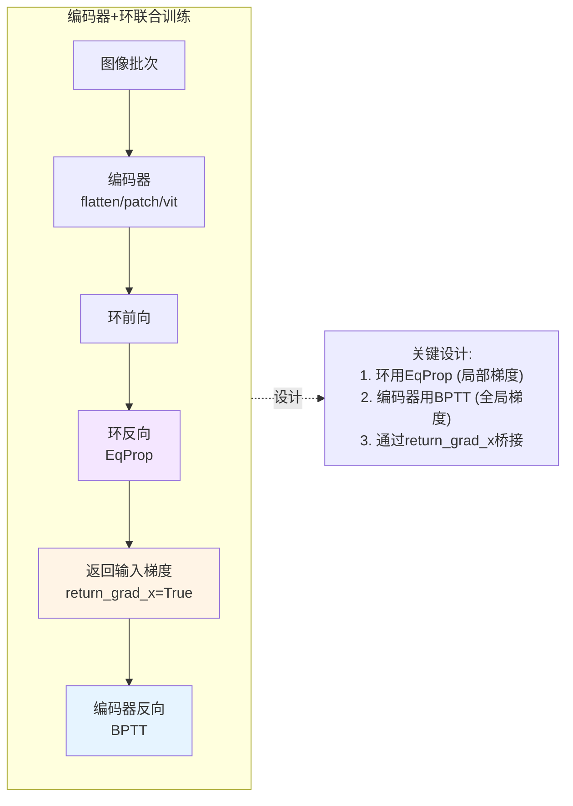
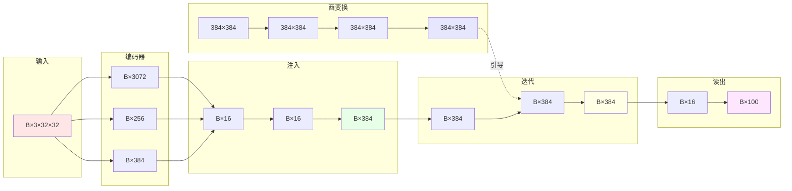
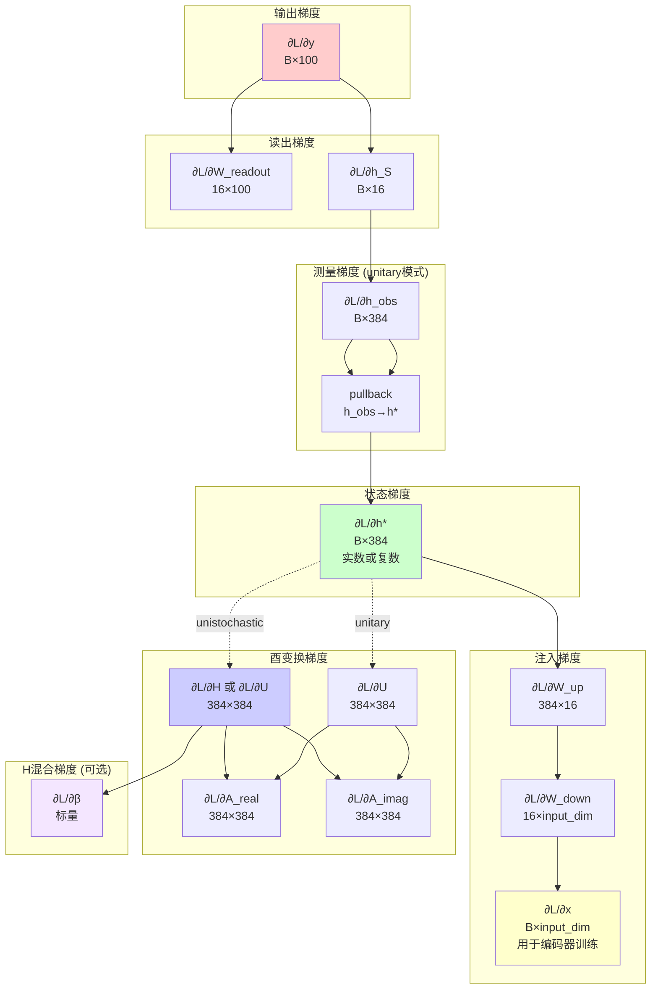
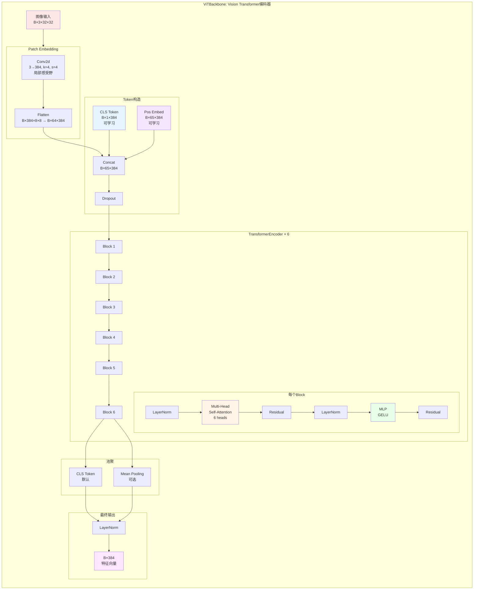

# Möbius Quantum Ring 网络架构图 (Mermaid) - 更新版 v2.0

> **版本说明**: 本文档基于最新代码更新，包含复数动力学、ViT编码器等新特性

**最后更新**: 2025-01-07

---

## 目录

1. [整体架构图](#1-整体架构图)
2. [两种动力学模式对比](#2-两种动力学模式对比)
3. [Cayley酉变换详细流程](#3-cayley酉变换详细流程)
4. [H混合机制](#4-h混合机制)
5. [固定点迭代动力学](#5-固定点迭代动力学)
6. [训练流程完整图](#6-训练流程完整图)
7. [模块维度流转](#7-模块维度流转)
8. [参数梯度反向传播路径](#8-参数梯度反向传播路径)
9. [ViT编码器结构](#9-vit编码器结构)

---## 1. 整体架构图

```mermaid
graph TB
    subgraph Input["输入层"]
        IMG[图像输入<br/>B×3×32×32]
    end

    subgraph Encoder["图像编码器 (可选3种)"]
        direction TB
        ENC_FLAT{编码器模式?}
        FLAT[Flatten<br/>B×3072<br/>0参数]
        PATCH[Patch Embed<br/>Conv2d+LayerNorm<br/>B×256<br/>36K参数]
        VIT[ViT Encoder<br/>Transformer×6<br/>B×384<br/>7M参数]
        
        ENC_FLAT -->|flatten| FLAT
        ENC_FLAT -->|patch| PATCH
        ENC_FLAT -->|vit| VIT
    end

    subgraph Ring["Möbius Quantum Ring 核心环"]
        direction TB
        
        subgraph ModeChoice["动力学模式"]
            MODE{dynamics_mode?}
            MODE_U[unistochastic<br/>实数值]
            MODE_C[unitary<br/>复数值]
            
            MODE -->|默认| MODE_U
            MODE -->|可选| MODE_C
        end
        
        subgraph Injection["哈密顿注入 LoRA"]
            DOWN[Linear<br/>input_dim→16]
            ACT[Activation<br/>可选]
            UP[Linear<br/>16→384]
            DOWN --> ACT --> UP
        end
        
        subgraph Unitary["酉变换模块"]
            A_REAL[A_real<br/>384×384]
            A_IMAG[A_imag<br/>384×384]
            CAYLEY[Cayley变换<br/>U=(I-A)⁻¹(I+A)]
            H_CALC[H=|U|²<br/>unistochastic]
            U_OUT[U<br/>unitary]
            
            A_REAL & A_IMAG --> CAYLEY
            CAYLEY --> H_CALC
            CAYLEY -.复数.-> U_OUT
        end
        
        subgraph Mix["H混合 (可选)"]
            BETA[h_mix_beta<br/>可学习或固定]
            H_EFF[H_eff = (1-β)I + βH<br/>unistochastic]
            
            H_CALC --> H_EFF
            BETA --> H_EFF
        end
        
        subgraph Relaxation["固定点迭代 (20步)"]
            INIT[h₀=0<br/>B×384]
            ITER_R[实数迭代:<br/>h_{t+1}=σ<br/>((1-α)h_tH^T+αJ)]
            ITER_C[复数迭代:<br/>h_{t+1}=<br/>(1-α)h_tU^†+αJ]
            FINAL[h*<br/>平衡态]
            
            INIT --> ITER_R
            INIT --> ITER_C
            ITER_R --> FINAL
            ITER_C --> FINAL
        end
        
        subgraph Measure["测量 (unitary模式)"]
            M_ABS[|h*|<br/>模]
            M_REAL[Re[h*]<br/>实部]
            
            M_ABS & M_REAL --> FINAL
        end
        
        subgraph Readout["局部投影读出"]
            SAMPLE[节点选择<br/>h*[:, :16]]
            LIN[Linear<br/>16→100]
            
            SAMPLE --> LIN
        end
        
        J(x) --> INIT
        H_EFF -.引导.-> ITER_R
        U_OUT -.引导.-> ITER_C
        FINAL --> SAMPLE
    end

    subgraph Output["输出层"]
        LOGITS[Logits<br/>B×100]
        SOFTMAX[Softmax]
        PROBS[预测概率<br/>B×100]
        
        LIN --> LOGITS --> SOFTMAX --> PROBS
    end

    IMG --> ENC_FLAT
    FLAT & PATCH & VIT --> DOWN
    UP --> J(x)

    style MODE_U fill:#e6f4ff
    style MODE_C fill:#ffe6f4
    style VIT fill:#fff4e6
    style BETA fill:#f4e6ff
```

## 2. 两种动力学模式对比

```mermaid
graph LR
    subgraph Compare["动力学模式对比"]
        direction TB
        
        subgraph UniSto["Unistochastic模式 (默认)"]
            direction TB
            US_IN[输入: x ∈ ℝ^d]
            US_H[U → H = |U|² ∈ ℝ^N×N]
            US_MIX[H_eff = (1-β)I + βH]
            US_ITER[h ← σ((1-α)hH^T + αJ)<br/>h ∈ ℝ^N]
            US_OUT[输出: y ∈ ℝ^C]
            
            US_IN --> US_H
            US_H --> US_MIX
            US_MIX --> US_ITER
            US_ITER --> US_OUT
        end
        
        subgraph Unitary["Unitary模式 (新)"]
            direction TB
            U_IN[输入: x ∈ ℝ^d]
            U_KEEP[U ∈ ℂ^N×N<br/>保留相位]
            U_ITER[h ← (1-α)hU^† + αJ<br/>h ∈ ℂ^N]
            U_MEAS[测量: h_obs = |h| 或 Re h]
            U_OUT[输出: y ∈ ℝ^C]
            
            U_IN --> U_KEEP
            U_KEEP --> U_ITER
            U_ITER --> U_MEAS
            U_MEAS --> U_OUT
        end
    end

    style UniSto fill:#e6f4ff
    style Unitary fill:#ffe6f4
    style US_H fill:#cce6ff
    style U_KEEP fill:#ffcce6
```

**对比表**:

| 特性 | Unistochastic | Unitary |
|-----|---------------|---------|
| 状态空间 | ℝ^N | ℂ^N |
| 转移矩阵 | H = \|U\|² | U |
| 物理类比 | 概率转移 | 量子态演化 |
| 相位信息 | 丢失 | 保留 |
| 测量 | identity | abs/real |
| 适用 | 标准DL任务 | 相位敏感任务 |## 3. Cayley酉变换详细流程

```mermaid
graph LR
    subgraph Params["可学习参数"]
        R[A_real<br/>实部矩阵<br/>384×384]
        I[A_imag<br/>虚部矩阵<br/>384×384]
    end

    subgraph Skew["构造斜埃尔米特矩阵"]
        S1[R - R^T<br/>斜对称实部]
        S2[I + I^T<br/>对称虚部]
        COMB[0.5×<br/>(S₁ + i·S₂)]
        
        S1 & S2 --> COMB
    end

    subgraph Cayley["Cayley变换"]
        ID1[I - A]
        ID2[I + A]
        SOLV[求解<br/>(I+A)U=(I-A)]
        
        ID1 & ID2 --> SOLV
    end

    subgraph Output["两种输出"]
        H_OUT[H = |U|²<br/>双随机矩阵<br/>unistochastic]
        U_OUT[U<br/>酉矩阵<br/>unitary]
        
        ABS[取模]
        SQ[平方]
        
        SOLV --> U_OUT
        SOLV --> ABS
        ABS --> SQ
        SQ --> H_OUT
    end

    R & I --> S1 & S2
    COMB --> ID1 & ID2

    A[斜埃尔米特<br/>A†=-A] --> Cayley
    U[酉矩阵<br/>U∈U(N)] --> Output
    H[双随机矩阵<br/>∑ᵢ∑ⱼHᵢⱼ=1] --> Done((完成))

    style A fill:#e1f5ff
    style U fill:#ffe1f5
    style H fill:#f5ffe1
```

## 4. H混合机制 (自保留)

```mermaid
graph TB
    subgraph HMix["H混合: H_eff = (1-β)I + βH"]
        direction TB
        
        I_MAT[I<br/>单位矩阵<br/>384×384]
        H_MAT[H<br/>双随机矩阵<br/>384×384]
        
        BETA_SRC[β来源]
        BETA_FIX[固定值<br/>β ∈ [0,1]]
        BETA_LEARN[可学习<br/>β = sigmoid(θ)]
        
        BETA_SRC --> BETA_FIX
        BETA_SRC --> BETA_LEARN
        
        SCALE_I[(1-β)×I]
        SCALE_H[β×H]
        
        SUM[H_eff = (1-β)I + βH<br/>仍然双随机]
        
        I_MAT --> SCALE_I
        H_MAT --> SCALE_H
        SCALE_I & SCALE_H --> SUM
        BETA_FIX & BETA_LEARN --> SCALE_I & SCALE_H
    end

    effect["效果:<br/>β=1: 完全双随机<br/>β<1: 增加自保留<br/>β=0: 无混合"]

    HMix --> effect

    style I_MAT fill:#e6f4ff
    style H_MAT fill:#ffe6f4
    style SUM fill:#f4e6ff
    style BETA_LEARN fill:#fff4e6
```

**物理意义**:
- β = 1: 完全由H决定 (默认，强混合)
- β = 0: 完全自保留 (无信息混合)
- 0 < β < 1: 平衡自保留和全局混合

**理论保证**:
- 双随机性: H_eff仍是双随机矩阵 (凸组合)
- 收敛性: ||H_eff||_∞ = 1 (保持压缩性质)

**可学习β**:
```python
# Logistic parameterization (约束在[0,1])
h_mix_beta_param = log(β / (1-β))  # 初始参数
β = sigmoid(h_mix_beta_param)       # 前向传播
grad_β = (grad_H · (H - I)).sum() / N  # 梯度
```## 5. 固定点迭代动力学

### 5.1 Unistochastic模式 (实数值)

```mermaid
graph TB
    subgraph Forward["正向环 (推理 - 实数)"]
        INJECT[J(x) = Injection_LoRA x<br/>外部驱动力]
        H_BASE[H_base = |U|²<br/>双随机矩阵]
        
        BETA[h_mix_beta<br/>可学习或固定]
        H_EFF[H_eff = (1-β)I + βH<br/>有效转移矩阵]
        
        INIT["h₀ = 0<br/>初始化 (实数)"]
        
        subgraph Loop["迭代循环 (t=1..20)"]
            direction TB
            MIX["混合:<br/>m_t = (1-α)·h_{t-1}·H_eff^T<br/>+ α·J(x)"]
            ACT["激活:<br/>h_t = σ(m_t)<br/>none/relu/tanh"]
            
            MIX --> ACT
        end
        
        STAR["h* = h₂₀<br/>平衡态 (实数)"]
        
        INJECT & H_BASE & BETA --> H_EFF
        INIT --> Loop
        Loop --> STAR
    end

    subgraph Backward["伴随环 (训练 - 实数)"]
        GRAD["∇_y L<br/>输出梯度"]
        GRAD_H["∇_h* L<br/>状态梯度"]
        
        INIT_DAG["h₀^† = 0<br/>初始化"]
        
        subgraph LoopDag["伴随迭代 (t=1..20)"]
            direction TB
            MIX_DAG["混合:<br/>h_t^† = (1-α)·h_{t-1}^†·H_eff<br/>+ α·∇_h* L"]
            ACT_DAG["调制:<br/>h_t^† = h_t^† ⊙ σ'(h*)"]
            
            MIX_DAG --> ACT_DAG
        end
        
        DAG["h^† = h₂₀^†<br/>伴随态 (实数)"]
        
        GRAD --> GRAD_H
        GRAD_H --> INIT_DAG
        INIT_DAG --> LoopDag
        LoopDag --> DAG
    end

    subgraph Update["参数更新"]
        GRAD_H2["∂L/∂H ≈ h^† ⊗ h*<br/>外积近似"]
        GRAD_H_BASE["∂L/∂H_base = β·∂L/∂H_eff<br/>链式法则"]
        MANIFOLD["ΔA ∝ skew(U^† ·<br/>(∂L/∂H_base ⊙ U ⊙ Ū))<br/>流形梯度"]
        UPDAT["参数更新:<br/>A ← A - η·ΔA"]
        
        GRAD_H2 --> GRAD_H_BASE
        GRAD_H_BASE --> MANIFOLD
        MANIFOLD --> UPDAT
        
        GRAD_BETA["∂L/∂β = (H - I):∂L/∂H_eff<br/>可学习β的梯度"]
        GRAD_H2 --> GRAD_BETA
    end

    Forward --> Backward --> Update

    style J fill:#fff4e6
    style H_EFF fill:#e6f4ff
    style h_star fill:#f4e6ff
    style h_dag fill:#ffe6f4
    style BETA fill:#f4e6ff
```

### 5.2 Unitary模式 (复数值)

```mermaid
graph TB
    subgraph Forward_C["正向环 (推理 - 复数)"]
        INJECT_C[J(x) → J_c = J + 0i<br/>转换为复数]
        U_MAT[U ∈ ℂ^N×N<br/>酉矩阵]
        
        INIT_C["h₀ = 0<br/>初始化 (复数)"]
        
        subgraph Loop_C["迭代循环 (t=1..20)"]
            direction TB
            MIX_C["混合:<br/>m_t = (1-α)·h_{t-1}·U^†<br/>+ α·J_c"]
            NO_ACT["无激活函数<br/>保持复数线性"]
            
            MIX_C --> NO_ACT
        end
        
        STAR_C["h* = h₂₀<br/>平衡态 (复数)<br/>保留相位"]
        
        INJECT_C & U_MAT --> INIT_C
        INIT_C --> Loop_C
        Loop_C --> STAR_C
    end

    subgraph Measure["测量"]
        MEAS_CHOICE{measurement?}
        ABS["|h*|<br/>取模"]
        REAL["Re[h*]<br/>取实部"]
        H_MEAS["h_obs<br/>测量后的状态 (实数)"]
        
        MEAS_CHOICE -->|abs| ABS
        MEAS_CHOICE -->|real| REAL
        ABS & REAL --> H_MEAS
    end

    subgraph Backward_C["伴随环 (训练 - 复数)"]
        GRAD_C["∇_y L<br/>输出梯度"]
        GRAD_H_C["∇_h_obs L<br/>测量空间梯度"]
        PULLBACK["梯度回传:<br/>∇_h* L = pullback<br/>(h_obs, ∇_h_obs L)"]
        
        INIT_DAG_C["h₀^† = 0<br/>初始化 (复数)"]
        
        subgraph LoopDag_C["伴随迭代 (t=1..20)"]
            direction TB
            MIX_DAG_C["混合:<br/>h_t^† = (1-α)·h_{t-1}^†·U<br/>+ α·∇_h* L"]
            
            MIX_DAG_C
        end
        
        DAG_C["h^† = h₂₀^†<br/>伴随态 (复数)"]
        
        GRAD_C --> GRAD_H_C
        GRAD_H_C --> PULLBACK
        PULLBACK --> INIT_DAG_C
        INIT_DAG_C --> LoopDag_C
        LoopDag_C --> DAG_C
    end

    subgraph Update_C["参数更新"]
        GRAD_U["∂L/∂U ≈ h^† ⊗ h*<br/>外积近似 (复数)"]
        MANIFOLD_C["ΔA ∝ skew(U^† · ∇_U L)<br/>流形梯度"]
        UPDAT_C["参数更新:<br/>A ← A - η·ΔA"]
        
        GRAD_U --> MANIFOLD_C
        MANIFOLD_C --> UPDAT_C
    end

    Forward_C --> Measure
    Measure --> Backward_C --> Update_C

    style U_MAT fill:#ffcce6
    style STAR_C fill:#ffe6f4
    style H_MEAS fill:#f4e6ff
```

**关键差异**:

| 特性 | Unistochastic | Unitary |
|-----|---------------|---------|
| 状态 | ℝ^N | ℂ^N |
| 转移 | H_eff | U |
| 激活 | 可选 | 无 (复数线性) |
| 测量 | identity | abs/real |
| 物理类比 | 概率分布 | 量子态 |## 6. 训练流程完整图 (含编码器联合训练)

```mermaid
stateDiagram-v2
    [*] --> ForwardPass: 开始训练批次
    
    state ForwardPass {
        [*] --> Encode: 图像→向量
        Encode --> Inject: J(x)=LoRA(x)
        Inject --> BuildH: H=|U|² 或 U
        BuildH --> MixH: H_eff=(1-β)I+βH<br/>(仅unistochastic)
        MixH --> Relax: 迭代到h*
        Relax --> Measure: 测量<br/>(仅unitary)
        Measure --> Readout: y=W·h*_S
        Readout [*]: 前向完成
    }
    
    ForwardPass --> Loss: 计算损失
    
    state Loss {
        [*] --> CE: 交叉熵
        CE --> Grad: ∇_y L
        Grad [*]
    }
    
    Loss --> Adjoint: 传播梯度
    
    state Adjoint {
        [*] --> MapGrad: ∇_y L→∇_h* L
        MapGrad --> Iterate: 伴随迭代
        Iterate --> h_dag: h^†
        h_dag [*]
    }
    
    Adjoint --> GradH: 计算哈密顿梯度
    
    state GradH {
        [*] --> Outer: ∂L/∂H ≈ h^†⊗h*
        Outer --> Chain: ∂L/∂H_base = β·∂L/∂H_eff
        Chain [*]
    }
    
    GradH --> Manifold: 流形投影
    
    state Manifold {
        [*] --> Transform: U^†·(∂L/∂H ⊙ H)
        Transform --> Skew: skew(·)
        Skew --> DeltaA: ΔA
        DeltaA [*]
    }
    
    Manifold --> UpdateRing: 更新环参数
    
    state UpdateRing {
        [*] --> A_real: A_real ← A_real - η·Re(ΔA)
        [*] --> A_imag: A_imag ← A_imag - η·Im(ΔA)
        [*] --> LoRA: W_LoRA ← W - η·∇
        [*] --> Beta: β ← β - η·∇_β<br/>(可选)
        A_real & A_imag & LoRA & Beta [*]
    }
    
    UpdateRing --> CheckEncoder: 需要训练编码器?
    
    CheckEncoder --> ComputeGradX: 是
    CheckEncoder --> [*]: 否
    
    state ComputeGradX {
        [*] --> InjGrad: ∇_J L
        InjGrad --> DownGrad: ∇_x L = dz·W_down^T
        DownGrad [*]
    }
    
    ComputeGradX --> BackwardEncoder: 反向传播到编码器
    
    state BackwardEncoder {
        [*] --> BackProp: x_vec.backward(∇_x L)
        BackProp --> StepEnc: encoder_optimizer.step()
        StepEnc [*]
    }
    
    BackwardEncoder --> [*]: 下一个批次
```



### 编码器联合训练流程



**优势**:
- **两阶段优化**: 环的局部梯度 + 编码器的全局梯度
- **灵活学习率**: encoder_lr_ratio控制编码器学习率
- **端到端**: 可联合训练或分阶段训练

## 7. 模块维度流转 (CIFAR-100 示例)



**三种编码器对比**:

| 编码器 | 输出维度 | 参数量 | 计算量 |
|--------|---------|--------|--------|
| flatten | 3072 | 0 | 0 |
| patch | 256 | 36K | ~3M |
| vit | 384 | 7M | ~60M |

## 8. 参数梯度反向传播路径



## 9. ViT编码器结构



**ViT参数详情**:

| 层 | 维度 | 参数量 |
|---|------|--------|
| Patch Embed | 3×4×4×384 | 18.4K |
| Pos Embed | 65×384 | 25.0K |
| CLS Token | 1×384 | 384 |
| **单个Transformer Block** | | |
| - QKV projection | 384×3×384 | 442K |
| - Output projection | 384×384 | 147K |
| - MLP (2 layers) | 384×1536×384 | 2.2M |
| **单个Block小计** | | ~2.8M |
| **6个Blocks** | | ~16.8M |
| **总计** | | ~17M |

**配置建议**:
- **CIFAR-10/100**: vit_dim=384, depth=6 (默认)
- **ImageNet**: vit_dim=768, depth=12 (标准ViT-B)
- **轻量级**: vit_dim=256, depth=4

---

## 使用说明

1. **整体架构图**: 展示三种编码器选项和两种动力学模式
2. **动力学模式对比**: Unistochastic vs Unitary
3. **Cayley变换图**: 酵矩阵的构造过程
4. **H混合机制**: 自保留的可学习β
5. **固定点迭代图**: 展示正向和反向动力学（两种模式）
6. **训练流程图**: 完整的训练步骤状态机（含编码器联合训练）
7. **维度流转图**: 各层张量的维度变化
8. **梯度传播图**: 反向传播路线（含β梯度）
9. **ViT编码器图**: Vision Transformer详细结构

这些图表配合 `docs/network_architecture_detailed.md` 一起使用，从多个角度理解MQR v2.0的架构设计。